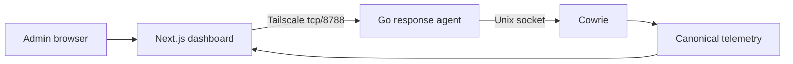
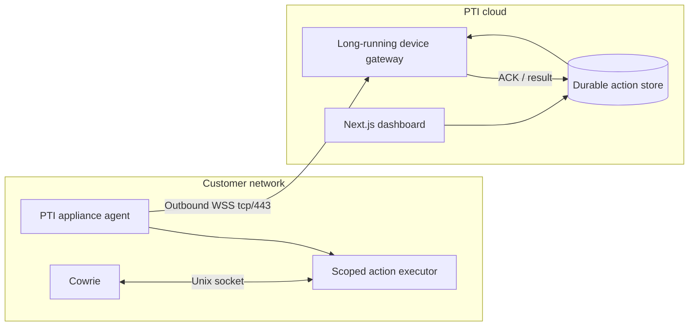
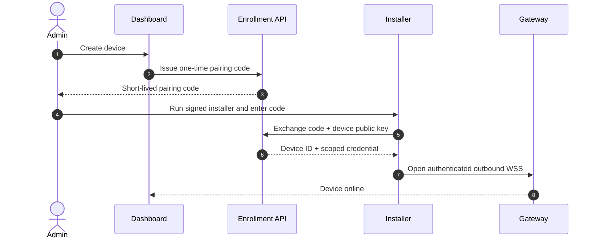

# PTI Honeypot Portal and Installer Blueprint

เอกสารนี้เป็นพิมพ์เขียวสำหรับเปลี่ยนระบบ PTI จาก deployment ที่ทีมควบคุมเอง
ไปเป็น software appliance ที่ติดตั้งบน Raspberry Pi ของลูกค้าได้อย่างปลอดภัย
เอกสารนี้ **ไม่ใช่ installer ที่พร้อมนำไปรัน** และ code block ทุกส่วนเป็น contract
หรือ pseudocode จนกว่าจะผ่าน acceptance criteria ในหัวข้อท้ายเอกสาร

แหล่งอ้างอิงสถานะจริงของระบบคือ:

- [`CURRENT-ARCHITECTURE.md`](./CURRENT-ARCHITECTURE.md)
- [`SERVICE-CATALOG.md`](./SERVICE-CATALOG.md)
- [`RESPONSE-CONTROL-PLANE.md`](./RESPONSE-CONTROL-PLANE.md)

หากเอกสารนี้ขัดกับเอกสารสถานะจริง ให้ยึดเอกสารสถานะจริงก่อนและเปิด ADR
เพื่ออนุมัติการเปลี่ยนสถาปัตยกรรม

## 1. ข้อสรุปทางสถาปัตยกรรม

### 1.1 สิ่งที่พิสูจน์แล้วในระบบปัจจุบัน

- Dashboard ส่งคำสั่ง terminate session ไปยัง Pi ผ่าน Tailscale ได้
- Go response agent รับเฉพาะ session ID ที่ผ่าน validation
- Agent สั่ง Cowrie ผ่าน Unix socket โดยไม่เปิด shell หรือ generic command API
- Dashboard ตรวจ Admin role, บันทึก action ID และยืนยันผลจาก
  `cowrie.session.closed` ใน MongoDB
- Agent bind เฉพาะ Tailscale address และมี authenticated readiness endpoint

เส้นทางที่พิสูจน์แล้วคือ:

```text
Admin browser
  -> same-origin Next.js route
  -> Tailscale HTTP + service credential
  -> Go response agent
  -> Cowrie Unix control socket
  -> exact transport session
  -> MongoDB verification and audit
```

### 1.2 สิ่งที่ยังเป็นงานเป้าหมาย

ระบบสำหรับลูกค้าที่อยู่หลัง NAT ต้องเพิ่ม outbound gateway, device enrollment,
device registry และ appliance installer งานเหล่านี้ยังไม่มี implementation ที่
production-ready ใน repository นี้

```text
Admin browser
  -> Dashboard action route
  -> Durable action store
  -> Device gateway
  <- outbound WSS initiated by customer Pi
  -> allow-listed action executor
  -> Cowrie Unix control socket
```

### 1.3 การตัดสินใจสำคัญ

1. ใช้ Tailscale direct control เป็น development และ managed-deployment path ต่อไป
2. ใช้ outbound WSS บน TCP 443 สำหรับ customer appliance ที่ไม่ควรรับ inbound
   management connection
3. ใช้ action executor และ audit contract เดียวกันทั้งสอง transport
4. Phase แรกอนุญาตเพียง `DISCONNECT_SESSION`
5. ห้าม arbitrary shell, arbitrary file operation และ generic container control
6. ห้าม mount `/var/run/docker.sock` เข้า management agent แม้จะใช้ `:ro`
7. การ containerize Cowrie ปัจจุบันเป็น migration แยก ไม่ใช่ผลข้างเคียงของ installer

## 2. ขอบเขตของ Control Plane

### 2.1 Phase 1 operations

| Operation | Input | Required result |
| --- | --- | --- |
| `DISCONNECT_SESSION` action | Cowrie transport ID แบบ lowercase hex 12 ตัวอักษรและ action UUID | ตัดเฉพาะ transport ที่ระบุและยืนยัน closure จาก canonical telemetry |
| `GET /v1/health` readiness probe | ไม่มี mutation | ตรวจ agent และ Cowrie control socket โดยไม่ส่ง action |

`DISCONNECT_SESSION` ต้องไม่รายงานสำเร็จจากการรับ message เพียงอย่างเดียว สถานะ
สำเร็จสุดท้ายเกิดเมื่อระบบพบ closure event ของ session เดียวกันหลังเวลาที่ร้องขอ

### 2.2 Actions ที่ยังไม่อนุมัติ

รายการต่อไปนี้ต้องมี threat model, ADR, least-privilege helper และ rollback ของตนเอง:

- `BLOCK_IP`
- `RESTART_HONEYPOT`
- `UPDATE_CONFIG`
- operating-system update
- host reboot

การเพิ่ม action ใหม่ห้ามขยาย protocol ให้รับ command string ต้องเพิ่ม enum, schema,
authorization, audit fields และ executor ที่เจาะจงกับ action นั้น

## 3. Transport Strategy

### 3.1 Phase A: Tailscale direct control

ใช้กับ local development, staging และ deployment ที่ทีม PTI ดูแลเอง:



ข้อกำหนด:

- Agent bind เฉพาะ Tailscale IP
- Tailnet grant อนุญาตเฉพาะ `tag:pti-dashboard` ไปยัง `tag:honeypot-pi`
- Human operator ไม่มีสิทธิ์เรียก agent port โดยตรง
- Credential อยู่ใน server-side credential file เท่านั้น

รายละเอียด deployment อยู่ใน [`integrations/tailscale/`](../integrations/tailscale/)

### 3.2 Phase B: Customer outbound gateway

ใช้กับ Pi ของลูกค้าที่อยู่หลัง NAT หรือไม่มี inbound management route:



Gateway ต้องรันบน runtime ที่รองรับ long-lived connection โดยตรง ไม่ผูกอายุของ
socket กับ Next.js request หรือ serverless function อายุสั้น Dashboard กับ Gateway
deploy แยกกันได้ แต่ใช้ action store และ authorization contract ร่วมกัน

### 3.3 Transport-independent executor

ก่อนสร้าง WSS agent ให้แยก code ปัจจุบันเป็นขอบเขตดังนี้:

```go
type Executor interface {
    Ready(context.Context) error
    Terminate(context.Context, ActionID, SessionID string) (Result, error)
}
```

- HTTP/Tailscale adapter เรียก `Executor` สำหรับ deployment ปัจจุบัน
- WSS adapter เรียก `Executor` เดียวกันสำหรับ customer appliance
- Unix socket controller เป็น implementation หลัก
- Transport ไม่มีสิทธิ์สร้าง shell command หรือส่ง payload ที่ executor ไม่รู้จัก

### 3.4 Customer network contract

Customer appliance ต้องแยก attacker-facing exposure ออกจาก management traffic:

| Direction | Traffic | Default policy |
| --- | --- | --- |
| Inbound | Cowrie SSH/Telnet trap ports | เปิดตาม deployment profile ของลูกค้า |
| Inbound | Appliance management agent | ไม่เปิด port |
| Inbound | Host admin SSH | จำกัดเฉพาะ management source ที่ลูกค้าระบุ |
| Outbound | Device gateway WSS | อนุญาต TCP 443 ไปยัง gateway hostname |
| Outbound | DNS/NTP | ใช้ resolver และ time source ที่ลูกค้าอนุมัติ |
| Outbound | Artifact/update registry | ปิดโดย default หรืออนุญาตเฉพาะช่วง update |

การใช้ WSS บน 443 ช่วยให้ผ่าน NAT แต่ไม่รับประกันว่าจะผ่านทุก enterprise proxy,
TLS inspection หรือ egress allow-list จึงต้องมี preflight connectivity test และ
แสดง hostname/IP requirements ให้ผู้ดูแลทราบ ห้าม fallback ไปใช้ plaintext transport

## 4. Device Identity และ Pairing

### 4.1 Enrollment flow



ข้อกำหนดของ pairing code:

- ใช้ครั้งเดียวและหมดอายุภายในช่วงสั้น
- ผูกกับ device record ที่ผู้ดูแลสร้างไว้
- ห้ามบันทึกใน URL, shell history หรือ process arguments
- Installer รับผ่าน interactive prompt หรือ root-readable enrollment file
- Server ไม่ส่ง long-lived private key กลับมา หากรองรับได้ให้ Pi สร้าง key pair เอง

หลัง pairing ให้เก็บ device credential ในไฟล์ `0600 root:root` หรือ secret store ของ
ระบบ ห้ามเก็บใน Compose YAML, image layer, Git หรือ `NEXT_PUBLIC_*`

### 4.2 Device authorization

ทุก action ต้องผูกกับ:

- tenant/customer ID
- immutable device ID
- operator ID และ role
- action ID แบบ UUID
- action type และ schema version
- created, expiry และ delivered timestamps
- target session ID

Gateway ต้องตรวจว่า operator มีสิทธิ์ใน tenant และ device นั้นก่อน queue action
Appliance credential ใช้ได้เฉพาะ device ของตนเองและไม่มีสิทธิ์ข้าม device

## 5. WSS Protocol Contract

ทุก message ใช้ JSON schema แบบ versioned ในระยะแรก และมีขนาดสูงสุดที่กำหนด

```json
{
  "version": 1,
  "type": "ACTION",
  "message_id": "uuid",
  "device_id": "immutable-device-id",
  "issued_at": "RFC3339 timestamp",
  "expires_at": "RFC3339 timestamp",
  "action": {
    "name": "DISCONNECT_SESSION",
    "action_id": "uuid",
    "session_id": "abcdef123456"
  }
}
```

ข้อความขั้นต่ำ:

| Type | Direction | Purpose |
| --- | --- | --- |
| `HELLO` | Pi → Gateway | authenticate device และประกาศ protocol version |
| `HEARTBEAT` | Pi → Gateway | liveness, agent version และ bounded health summary |
| `ACTION` | Gateway → Pi | ส่ง allow-listed action |
| `ACTION_ACK` | Pi → Gateway | แจ้งว่า schema ผ่านและรับเข้าประมวลผล |
| `ACTION_RESULT` | Pi → Gateway | แจ้งผล delivery ไม่ใช่ canonical closure verification |
| `ERROR` | ทั้งสองทาง | machine-readable bounded error |

Protocol ต้องมี:

- TLS certificate validation และ device authentication
- expiry check และ clock-skew window ที่จำกัด
- idempotency ด้วย `action_id`
- replay rejection สำหรับ message ที่หมดอายุหรือเคยประมวลผลแล้ว
- bounded queue, message size, timeout และ reconnect backoff พร้อม jitter
- server heartbeat timeout และ device offline state
- redacted logs ที่ไม่บันทึก credential หรือ attacker payload

### 5.1 Action lifecycle

```text
requested -> queued -> delivered -> verified
                    \-> failed
          \-> expired
```

- `requested`: Dashboard ยืนยัน Admin intent และบันทึก audit แล้ว
- `queued`: รอ device online โดยยังไม่ถือว่าสำเร็จ
- `delivered`: Agent ACK และ executor ตอบรับ action เดียวกัน
- `verified`: Canonical Cowrie telemetry ยืนยัน session closure
- `failed`: schema, authorization, delivery หรือ execution ล้มเหลว
- `expired`: device ไม่รับ action ก่อน expiry

## 6. Customer Appliance Packaging

### 6.1 Fresh install และ existing migration ต้องแยกกัน

`install.sh` รุ่นแรกมีไว้สำหรับ clean, supported OS image เท่านั้น ห้ามใช้ script
เดียวกันย้าย Pi production ปัจจุบันจาก systemd Cowrie เข้า container โดยอัตโนมัติ

- **Fresh appliance:** ใช้ versioned package และ deployment layout ที่ผ่าน test matrix
- **Existing PTI Pi:** ใช้ migration runbook, staging transcript และ rollback receipt

### 6.2 Target package layout

```text
pti-honeypot-appliance/
├── install.sh
├── uninstall.sh
├── manifest.json
├── checksums.txt
├── compose.yaml
├── config/
│   ├── cowrie.cfg.template
│   └── userdb.txt
├── systemd/
│   └── pti-appliance.service
└── migration/
    └── README.md
```

Container images ต้อง build ใน CI สำหรับ architecture ที่รองรับ, pin ด้วย immutable
digest และมี SBOM/signature ห้ามใช้ `latest`

### 6.3 Container boundary

ถ้า fresh appliance ใช้ container:

- Cowrie และ appliance agent ใช้ shared Unix socket volume ที่ permission จำกัด
- Appliance agent ไม่มี published port
- Appliance agent ไม่มี Docker socket
- Drop Linux capabilities ทั้งหมดที่ไม่จำเป็น
- ใช้ `no-new-privileges`, read-only root filesystem และ writable mount เท่าที่จำเป็น
- กำหนด CPU, memory, PID และ log rotation limits จริงใน Compose
- Health check ต้องตรวจแต่ละ component โดยไม่ mutate session
- Telemetry spool ต้อง bounded และทน network outage

ตัวอย่าง boundary ต่อไปนี้เป็นโครง ไม่ใช่ไฟล์พร้อม deploy:

```yaml
services:
  cowrie:
    image: registry.example/pti-cowrie@sha256:<pinned-digest>
    ports:
      - "${PTI_TRAP_SSH_PORT}:2222"
    volumes:
      - cowrie-control:/run/cowrie-control
      - cowrie-logs:/var/log/cowrie
    security_opt: ["no-new-privileges:true"]
    cap_drop: ["ALL"]

  appliance-agent:
    image: registry.example/pti-appliance-agent@sha256:<pinned-digest>
    volumes:
      - cowrie-control:/run/cowrie-control
      - /etc/pti/device-credential:/run/secrets/device-credential:ro
    read_only: true
    tmpfs: ["/tmp"]
    security_opt: ["no-new-privileges:true"]
    cap_drop: ["ALL"]
    # No ports and no /var/run/docker.sock.

volumes:
  cowrie-control:
  cowrie-logs:
```

ค่าจริงของ user/group mapping, writable directories และ Cowrie hook ต้องผ่าน image
integration test ก่อนออก release

## 7. Safe Installer Contract

### 7.1 Installer input

```text
curl -fsSLo pti-install.sh https://<distribution-host>/releases/<version>/install.sh
verify installer signature/checksum
sudo bash pti-install.sh
```

ไม่ใช้ `curl | sudo bash` เป็นคำแนะนำหลัก เพราะผู้ดูแลควรตรวจ artifact และ signature
ก่อนรัน Installer จะ prompt pairing code ภายหลัง ไม่ใส่ long-lived token ใน command

### 7.2 Preflight ซึ่งต้องผ่านก่อนแก้ host

1. ตรวจ OS release, CPU architecture, free disk, RAM และเวลาระบบ
2. ตรวจ signature และ checksum ของ release manifest ทุก artifact
3. ตรวจ package manager lock และ network reachability ที่จำเป็น
4. ตรวจ port 22, 23, admin SSH port และ service ที่ครอบครองอยู่
5. ตรวจว่าเครื่องเป็น fresh install หรือ existing PTI deployment
6. ตรวจ firewall backend และบันทึก ruleset แบบ sanitized
7. สร้าง backup/rollback directory แบบ timestamped
8. หยุดทันทีเมื่อ preflight ไม่ชัดเจน ห้ามเดาสภาพ host

### 7.3 SSH และ trap-port safety

Installer ห้ามเปลี่ยน SSH port โดยอัตโนมัติ ค่าเริ่มต้นต้องให้ผู้ดูแลเลือก:

- ใช้ Cowrie trap บน non-privileged staging port ก่อน
- ใช้ management SSH port เดิมที่ไม่ชนกับ trap
- หรือร้องขอ explicit `--migrate-ssh` สำหรับ fresh appliance

เมื่อใช้ `--migrate-ssh` ต้องทำตามลำดับนี้:

1. สร้าง `sshd_config.d` drop-in แทนการแก้ main config ด้วย `sed`
2. เปิด firewall สำหรับ management source ที่ระบุ
3. ตรวจ `sshd -t`
4. start/reload SSH บน port ใหม่โดยยังไม่ปิดช่องทางเดิม
5. ให้ผู้ดูแลยืนยันการเชื่อมต่อใหม่หรือใช้ out-of-band console
6. ตั้ง rollback timer ก่อนนำ port เดิมออก
7. bind Cowrie ที่ port 22 หลัง management path ผ่านการยืนยันเท่านั้น

พอร์ตของ Pi ปัจจุบันคือ SSH `2222`; ค่า `22222` ไม่ใช่มาตรฐานของโปรเจกต์

### 7.4 Transactional installation

Installer ต้อง:

1. ดาวน์โหลด release ลง temporary directory
2. verify manifest, signature และทุก checksum
3. extract ไปยัง versioned release directory เช่น `/opt/pti/releases/<version>`
4. สร้าง config/secrets นอก immutable release directory
5. validate Compose และ systemd unit ก่อน enable
6. start บน staging/non-public trap port
7. รัน readiness และ synthetic-session smoke test
8. สลับ symlink `current` แบบ atomic เมื่อทุก check ผ่าน
9. apply firewall/exposure change เป็นขั้นสุดท้าย
10. เขียน installation receipt ที่ไม่มี secret

หากขั้นใดล้มเหลว ต้องคืน service, firewall และ SSH config จาก backup เดิม ไม่ทิ้ง
deployment ครึ่งทาง

## 8. Upgrade, Rollback และ Uninstall

### 8.1 Upgrade

- ใช้ immutable version และ atomic `current` symlink
- เก็บ previous release อย่างน้อยหนึ่งรุ่น
- database/config migration ต้อง backward-compatible กับ rollback window
- ตรวจ agent/gateway protocol compatibility ก่อนสลับ
- ห้าม auto-update major version

### 8.2 Rollback

Rollback receipt ต้องระบุ:

- release version และ image digests ก่อน/หลัง
- service/unit checksum
- sanitized port/firewall state
- config schema version
- backup directory
- health/smoke-test result

Rollback ต้องไม่ต้องพึ่ง cloud gateway ที่กำลังล่ม

### 8.3 Uninstall

ค่าเริ่มต้นของ uninstaller ต้อง preserve telemetry, Cowrie logs และ config ห้ามใช้
`docker compose down -v` หรือ `rm -rf` กับข้อมูลโดยอัตโนมัติ

- `uninstall`: หยุด service และคืน host config จาก exact backup
- `uninstall --purge-data`: ลบข้อมูลหลังแสดง path/size และได้รับ explicit confirmation
- Restore SSH จาก backup เดิม ไม่สมมติว่า config ก่อนติดตั้งคือ `Port 22`
- ตรวจว่า management SSH ใช้งานได้ก่อนนำ rollback timer ออก

## 9. Cloud Components ที่ต้องสร้าง

| Component | Responsibility |
| --- | --- |
| Device enrollment API | one-time pairing code, credential issuance/revocation |
| Device registry | tenant ownership, status, agent version, last seen |
| Device gateway | WSS authentication, heartbeat, bounded dispatch |
| Action store | durable queue, idempotency, expiry, lifecycle audit |
| Dashboard device UI | onboarding, health, confirmation, action history |
| Telemetry verifier | เปลี่ยน delivered เป็น verified จาก canonical event |

Gateway และ action store ต้องรองรับหลาย device โดยไม่ใช้ in-memory map เป็น
authoritative state การ restart gateway ต้องไม่ทำ action หายหรือส่งซ้ำแบบ mutate ซ้ำ

## 10. Delivery Plan

### Phase 0 — Direct-control baseline (development validated)

- Go response agent
- Cowrie Unix control socket
- Dashboard Admin action route
- Tailscale policy และ service credential
- readiness, audit และ closure verification

การเปลี่ยนจาก temporary developer-IP grant ไปเป็น tagged production dashboard
service identity ยังเป็น deployment work ไม่ถือว่า production rollout เสร็จแล้ว

### Phase 1 — Freeze action contract

- แยก executor ออกจาก HTTP transport
- สร้าง versioned action/result schema
- เพิ่ม idempotency persistence บน agent
- เพิ่ม protocol conformance tests

### Phase 2 — Outbound gateway MVP

- device registry และ one-time enrollment
- authenticated WSS connection
- heartbeat, reconnect, queue expiry และ action ACK/result
- dashboard device status
- synthetic Pi agent สำหรับ load/failure tests

### Phase 3 — Fresh-appliance packaging

- signed ARM64 release artifacts
- hardened Compose/systemd files
- transactional installer/uninstaller
- clean OS test matrix และ power-loss recovery test

### Phase 4 — Existing-Pi migration

- staging listener และ parity transcript
- telemetry compatibility check
- explicit maintenance window
- backup receipt และ proven rollback

อย่าเริ่ม Phase 3 ด้วยการ pack code ปัจจุบันทั้งหมดเข้า container ก่อน Phase 1–2
นิ่ง เพราะ installer จะตรึง protocol และ operational mistakes ให้แก้ยากขึ้น

## 11. Acceptance Criteria ก่อนเรียก Production-ready

### Control and authorization

- terminate synthetic session ที่ระบุได้และไม่กระทบ session อื่น
- invalid session ID และ unsupported action ถูกปฏิเสธ
- duplicate `action_id` ไม่ execute ซ้ำ
- expired/replayed message ถูกปฏิเสธ
- credential ผิด device หรือผิด tenant ใช้งานไม่ได้
- non-Admin operator สร้าง action ไม่ได้

### Connectivity and recovery

- Control plane ของ Pi ใช้งานหลัง NAT ได้โดยมีเพียง outbound TCP 443; attacker-facing
  trap ports เป็น exposure คนละขอบเขต
- gateway restart และ Pi reconnect ไม่ทำ action สูญหายหรือ execute ซ้ำ
- offline action หมดอายุตาม policy
- DNS/TLS failure ใช้ bounded exponential backoff
- telemetry spool ไม่โตไม่จำกัดเมื่อ cloud ล่ม

### Host safety

- ไม่มี shell endpoint และไม่มี Docker socket ใน agent
- management SSH ยังเข้าถึงได้ก่อนและหลัง install/rollback/uninstall
- installer ไม่ครอบครอง port 22 ก่อนยืนยัน alternate admin path
- power loss ระหว่าง install/upgrade กลับมาสู่ old หรือ new version ที่สมบูรณ์
- uninstaller ค่าเริ่มต้นไม่ลบข้อมูล

### Supply chain and operations

- image/artifact pin ด้วย digest และตรวจ signature
- ARM64 clean-OS matrix ผ่าน
- resource limits และ log rotation ถูกบังคับจริง
- secret ไม่ปรากฏใน Git, image, process arguments, logs หรือ receipt
- action lifecycle ตรวจย้อนหลังได้ตั้งแต่ operator ถึง Cowrie closure event

## 12. Definition of Done ของเอกสารนี้

เอกสารจะเปลี่ยนจาก `proposed` เป็น `approved` ได้เมื่อ:

1. มี ADR อนุมัติ outbound gateway และ appliance security boundary
2. Phase 1 schema อยู่ใน repository พร้อม conformance tests
3. Gateway threat model และ data model ผ่าน review
4. Fresh-appliance release ผ่าน acceptance criteria บน test Pi
5. Runbook rollback และ uninstall ถูกทดลองจริง

จนกว่าจะครบเงื่อนไขดังกล่าว ห้ามเผยแพร่ one-line installer ให้ลูกค้าใช้กับเครื่องจริง
