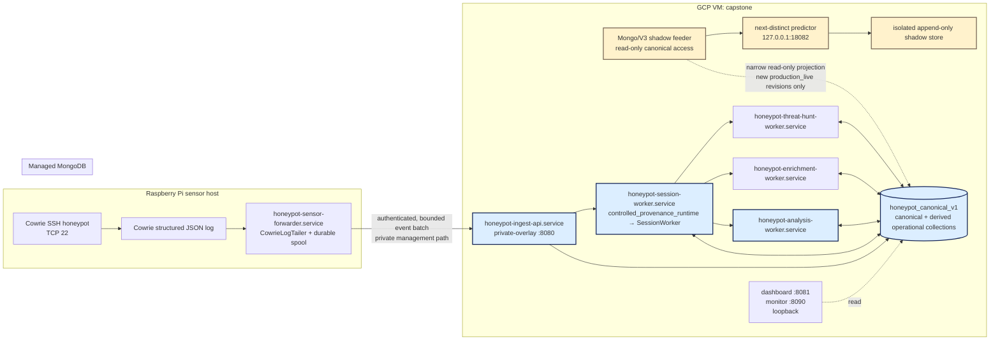
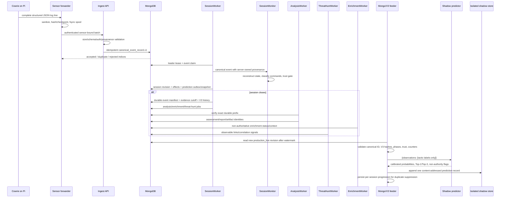
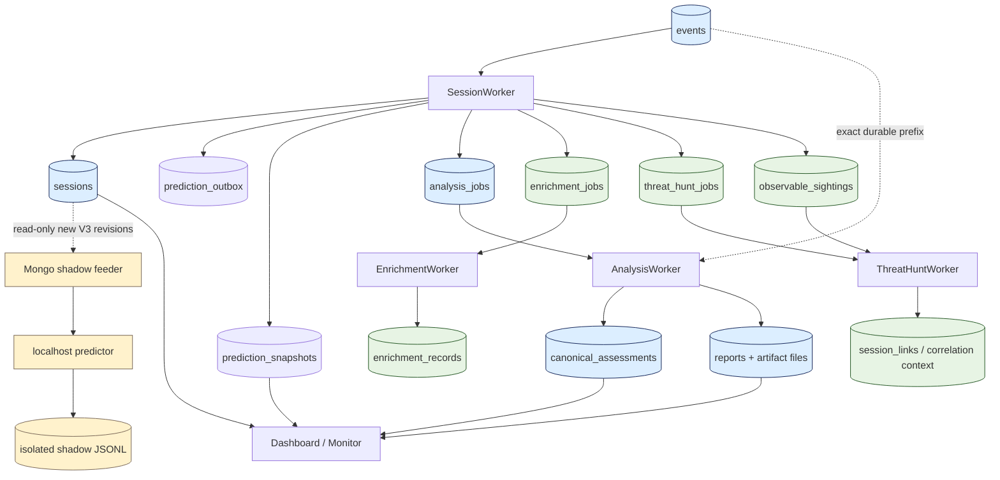
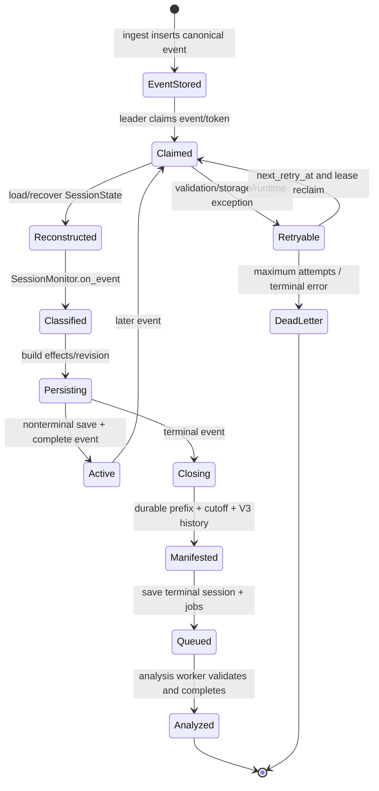
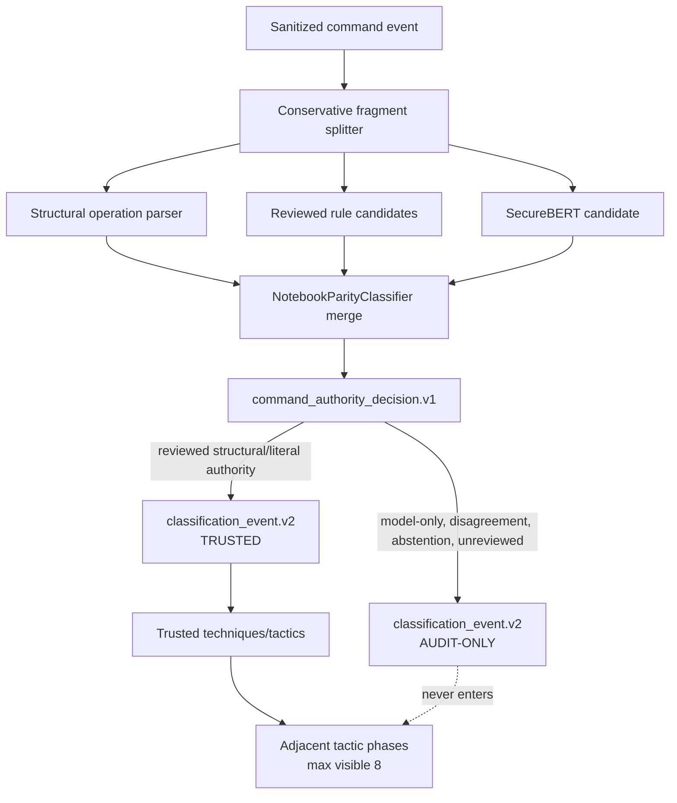
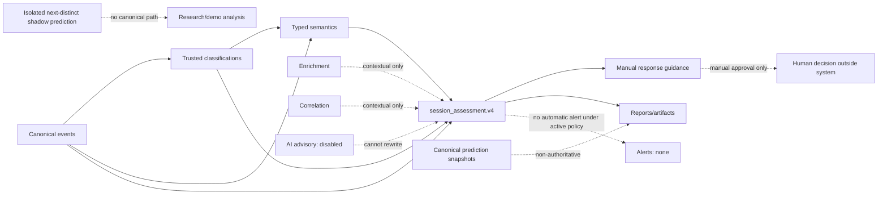
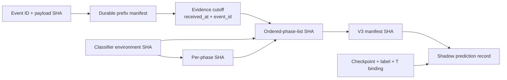

# Current honeypot-analysis system: full technical documentation

**System state described:** 2026-08-25 (Asia/Bangkok)  
**Runtime authority:** active GCP deployment and its exact content-addressed source tree  
**Active release:** `00d7e9594b11505c167f4e03bb3efffd9a90144b`  
**Recovery release:** `403c989d9cfe7e7726610018345352e76bfd5d7f`  
**Document status:** current-system technical reference; secrets and raw sensitive observations intentionally omitted

> **2026-08-25 live-state addendum.** Release
> `00d7e9594b11505c167f4e03bb3efffd9a90144b` is active after the final bounded
> live validation completed with all 50 invariants true. Its immutable package
> SHA-256 is `4597c15dfbcc69030097d6fa2a0f55ab8f8df366d15f2a60445842dbe9945fae`,
> deployed tree is `d061bb3b0cbb73d348d2748ee98b0404138f5096`, and release-manifest SHA-256
> is `e125c19c94dce085f276ae8d903e508b8c8574c89243182e03f62f9b36e0373e`.
> The terminal invariant receipt is
> `/var/lib/honeypot/validator_io_00d7_session_links_reconciled_20260825/final_live_invariant_receipt.json`
> (SHA-256 `b4cf0da8f5839bf36be22203a220ff48e50cb72541901adc717f77fcba2254c5`).
> Sections below that explicitly describe 403c or the 2026-08-24 inspection are
> retained as historical source/deployment evidence; this addendum supersedes
> only their statements that 403c is presently active. Full reconciliation is
> in `cleanup_audit/session_links_delta_reconciliation_20260825.md`.
>
> The authoritative controlled Cowrie endpoint is `100.118.43.30:22` over
> Tailscale. The former public `:2222` relay is not the current Cowrie path.
> V3 trusted history collapses repeated labels by semantic
> `(tactic, technique)` identity while retaining every evidence reference and
> provenance aggregate. The final invariant validator derives the exact
> `session_links` identity set from current threat-hunt relationship semantics;
> it does not assume a fixed count. The localhost shadow predictor remains
> `non_authoritative` with `canonical_write_allowed=false`.

## 1. Purpose, scope, and evidence discipline

This document answers the operational question: **a real Cowrie observation enters the system; what happens next, exactly?** It traces the observation from the Raspberry Pi sensor, through authenticated forwarding and canonical MongoDB persistence, session reconstruction, command classification, trust decisions, analysis, semantic findings, response guidance, correlation, the canonical prediction path, and the independent next-distinct-tactic shadow predictor.

The document is deliberately more precise than a general architecture summary. It identifies current processes, classes, functions, schemas, policies, collections, identities, failure modes, and authority boundaries. It also separates the current runtime from research evidence and from obsolete designs that remain in the repository.

### 1.1 Evidence labels used in this document

| Label | Meaning |
|---|---|
| **CURRENT VERIFIED** | Observed in the live runtime on 2026-08-24 and reconciled with the source materialized for the active release. |
| **CURRENT IMPLEMENTATION** | Present in the exact source/configuration tree bound to the active release; it may not have been exercised by the final live session. |
| **CURRENT RESEARCH / NON-AUTHORITATIVE** | Deployed or retained now, but explicitly unable to change canonical evidence, findings, severity, guidance, trust, alerts, or actions. |
| **DESIGN RATIONALE** | Supported by implementation structure, policy text, tests, or receipts, but not itself a measured runtime result. |
| **HISTORICAL / SUPERSEDED** | Preserved evidence of an earlier design or run; it is not the current source of runtime truth. |
| **FAILED CANDIDATE** | A reviewed attempt that failed closed and was rolled back; it is evidence, not the active system. |
| **DEVELOPMENT / TEST-ONLY** | A harness, fixture, synthetic benchmark, or offline artifact that does not consume or alter live canonical state. |
| **LIMITATION / INTERPRETATION** | A bounded conclusion from the evidence; it is not presented as a direct observation. |

### 1.2 How the 2026-08-24 baseline was established

The then-active system was inspected read-only through the approved management path. The `/opt/honeypot` selector resolved to:

```text
/opt/honeypot-releases/403c989d9cfe7e7726610018345352e76bfd5d7f
```

Its deployment markers bind:

| Identity | Verified value |
|---|---|
| Release ID / deployed commit | `403c989d9cfe7e7726610018345352e76bfd5d7f` |
| Full release SHA-256 | `403c989d9cfe7e7726610018345352e76bfd5d7fc75cc3952d3217a00e0c6669` |
| Deployed tree | `71428a1735a9802f878931153d242cd1d2cf23ee` |
| Release-manifest SHA-256 | `7a43ed039db5521c357c681dba5ca3e640b6c35dc544d669f77bc3481a3399ec` |

Live systemd unit state, effective `ExecStart`, service users, listener bindings, the non-secret portions of runtime configuration, the storage-epoch receipt, MongoDB collection metadata, the active policy files, the Raspberry Pi Cowrie/forwarder services, and the final controlled end-to-end evidence were cross-checked. No service was restarted, no runtime file was modified, and no MongoDB or shadow-feeder state was written during this documentation audit.

The exact active source inspected is preserved at:

```text
evaluation/receipts/gcp_cowrie_shadow_v3_mongo_finalizer_20260824/
  attempt-04/candidate_release/403c989d9cfe7e7726610018345352e76bfd5d7f/
```

Repository HEAD is useful for surrounding history and tests, but it is not substituted for this deployed tree when the two differ.

## 2. Executive technical determination

The current system is a two-host, policy-bound, event-driven honeypot analysis pipeline:

1. Cowrie on a Raspberry Pi receives SSH interactions and writes structured Cowrie JSON events.
2. A durable sensor forwarder tails complete JSON lines, sanitizes credential fields, spools before advancing its log cursor, and sends authenticated batches over the private management overlay to the GCP ingest API.
3. The ingest API binds the event to the authenticated sensor, derives a sensor-namespaced canonical session ID, constructs a deterministic `canonical_event_record.v1`, and idempotently stores it in MongoDB.
4. A single-leader `SessionWorker` claims events. Its in-process `SessionMonitor` reconstructs session state, interprets Cowrie event types, sanitizes command output, classifies commands, and separates trusted labels from audit-only candidates.
5. Trusted labels form bounded, ordered tactic phases. At each event the worker may create canonical next-behavior prediction snapshots through the existing internal runtime; on close it freezes a durable event-prefix manifest, a prediction evidence cutoff, and a V3 trusted-history manifest.
6. Closed eligible sessions produce analysis jobs. The analysis worker re-reads and verifies the durable event prefix, constructs one deterministic `session_assessment.v4`, typed semantic facts, a semantic graph, bounded behavioral chains and threat hypotheses, manual-only response guidance, and deterministic report artifacts.
7. Separate enrichment and threat-hunt workers add non-authoritative context and cross-session links. Current alert policy prohibits automatic alert creation, delivery, or response. The AI advisory worker is disabled.
8. Independently, a hardened MongoDB shadow feeder reads only new `production_live` session revisions after its activation watermark. It accepts only a fully valid V3 trusted-history manifest, sends only tactic labels to `127.0.0.1:18082/predict`, and appends a privacy-safe result outside canonical storage.
9. The shadow predictor runs the frozen 2,599-parameter next-distinct Transformer checkpoint `16506e...d283`, calibrated with the TRAIN-OOF temperature `0.6990670591704266`. It is explicitly `non_authoritative` and `canonical_write_allowed=false`.

The final controlled live validation proved the complete latter path for one new post-repair session: Pi Cowrie → authenticated ingest → MongoDB → reconstructed session → trusted Discovery phase → V3 manifest → Mongo feeder → localhost predictor → exactly one isolated record, followed by duplicate suppression and zero historical replay.

The system is therefore operationally verified as a **non-authoritative research and defensive-observation platform**, not as an autonomous response system, a model of attacker intent, or a production-grade general-purpose attack forecaster.

## 3. Current deployment topology



### 3.1 Physical roles

**Raspberry Pi.** Cowrie and the sensor forwarder run here. The actual approved honeypot listener is Cowrie SSH on TCP 22. TCP 2222 is the Pi management SSH path and was explicitly not used for honeypot test traffic. The Pi hosts other services that are outside this project's ownership scope; their presence must not be interpreted as part of honeypot-analysis.

**GCP VM `capstone`.** This host runs the active release, APIs, canonical workers, monitoring interfaces, the shadow feeder, and the isolated predictor. Ingest binds to the private overlay address on port 8080. Dashboard and monitor bind to loopback ports 8081 and 8090. The predictor binds only to `127.0.0.1:18082`; no public prediction endpoint exists.

**Managed MongoDB.** Database `honeypot_canonical_v1` is the current canonical storage authority. Credentials are delivered through systemd credentials/environment paths and were not read into this document.

**Rollback storage.** `/var/lib/honeypot/mongodb_epoch_retry_49f9b74.db` is the identity-bound SQLite rollback mirror. It is not the current canonical database. `/var/lib/honeypot/production_pilot.db` is a stale historical SQLite target that caused earlier audits/feeders to inspect the wrong source; it is not canonical authority.

**Shadow store.** Next-distinct predictions are appended under `/var/lib/honeypot-shadow/prediction-next-distinct/...`. This store is deliberately outside the production database and outside canonical report paths.

## 4. Complete execution-order data flow

The following trace follows one real event. Some close-time operations happen only when Cowrie emits terminal session events; some asynchronous workers run after queues are populated.



### 4.1 Stage 1 — Cowrie produces the earliest real input

The earliest verified project input is a structured event written by Cowrie on the Pi, not a dashboard request and not a prediction request. `cowrie.service` runs Cowrie under the `cowrie` account using the sanitized Cowrie launcher. Cowrie's event includes its raw session identifier, event type, timestamp, source/destination context, and event-specific fields such as authentication or command information.

Cowrie itself is the deception sensor; it is not the canonical analyzer. Its raw session identifier is not globally trusted, and its log is not yet the canonical database.

Privacy begins before canonical persistence. Cowrie's configured output path and the forwarder remove or transform credential-bearing fields according to the active `cowrie_output_privacy_policy.v1` policy (`cowrie_pre_persistence_credentials`, version `1.0.1`). The canonical runtime does not need plaintext credentials for classification. Where credential linkage is needed, the worker uses keyed/HMAC aliases under a separately loaded keyring rather than treating raw secrets as analytics fields.

### 4.2 Stage 2 — the Pi forwarder makes delivery durable

**Service:** `honeypot-sensor-forwarder.service` on the Pi  
**Source:** `production/workers/sensor_forwarder.py`  
**Main components:** `CowrieLogTailer`, `DiskSpool`, `RejectedEventQuarantine`, `ForwarderInstanceLock`, `run_forever()`

`CowrieLogTailer` reads only complete newline-delimited JSON records. Its checkpoint is not just a byte offset: it records file/device identity so log rotation can be distinguished from truncation or replacement. Partial trailing lines are held until complete. Invalid or over-limit lines are converted to bounded privacy-safe parse-error evidence containing length/hash/offset metadata, not copied verbatim to logs.

The critical durability order is:

1. Read complete log records.
2. Sanitize the event representation, including configured credential fields.
3. Append the outgoing batch to the local disk spool and `fsync` it.
4. Only then commit the tail checkpoint.
5. POST a bounded batch to ingest with bearer authentication and `X-Sensor-ID`.
6. Reconcile each index returned as accepted, duplicate, or permanently rejected.
7. Put permanent rejects into a bounded durable quarantine before removing them from the spool.
8. Retain retryable failures in the spool.

The forwarder uses a process lock to prevent two instances from independently advancing the same tail/spool state. Capacity guards bound the spool (64 MiB by default), reserve rewrite space, and require a free-space floor (32 MiB by default). If durability cannot be maintained, it stops advancing rather than silently dropping records. Spool and checkpoint files use restrictive modes.

The output is a bounded authenticated envelope containing the sensor identity and a list of sanitized structured events. The forwarder is a delivery component, not a classifier; it does not decide ATT&CK labels or canonical authority.

### 4.3 Stage 3 — authenticated ingest establishes provenance and identity

**Service:** `honeypot-ingest-api.service`  
**Source:** `production/api/ingest_api.py`; access controls in `production/api/security.py`  
**Main classes/functions:** `IngestHTTPServer`, `IngestHandler`, `build_server()`, `main()`

The ingest API listens on the private overlay, not a public analysis port. Its current bounds include a 5 MiB request body, at most 500 events per request, and at most 256 KiB for an individual live event. It applies:

- request-method/path and content-type checks;
- body length and JSON structure bounds;
- bearer-token authentication;
- constant-time token matching and unique identity mapping;
- equality of authenticated, header, envelope, and event sensor identities;
- event/session field shape validation;
- sanitization before storage;
- deterministic canonicalization and hashing.

The client-supplied sensor/session identity is not accepted as global truth. The server derives a sensor-namespaced canonical session identity of the form:

```text
session_v1_<32 lower-case hexadecimal characters>
```

from the authenticated sensor binding and the sensor's raw session identifier. Consequently two sensors that happen to emit the same raw Cowrie session ID cannot be merged accidentally.

The event is normalized into `CanonicalEventRecord` in `production/storage/canonical_event.py`, whose schema is `canonical_event_record.v1`. Important fields include the deterministic `event_id`, canonical `session_id`, authenticated `sensor_id`, normalized event type and timestamps, stable JSON payload, and `payload_sha256`. UTC timestamps are normalized with explicit timezone/microsecond semantics. The stable identity makes retries idempotent.

The API writes through the configured storage abstraction. The live environment overrides the stale JSON `database_backend=sqlite` setting with `DATABASE_BACKEND=mongodb`; startup storage checks bind that selection to the storage-epoch receipt. A successful duplicate is acknowledged as duplicate rather than inserted twice. Index-correlated accepted/duplicate/rejected results let the forwarder remove only fully accounted spool entries. A storage exception returns a server error so the Pi retains retryable data.

Health, liveness, and readiness endpoints return bounded operational status with no secret material; responses use no-store and content-sniffing protections.

### 4.4 Stage 4 — MongoDB becomes canonical event authority

The live backend is implemented by `production/storage/mongodb_backend.py` and `production/storage/mongodb_operations.py`, under the generic contract in `production/storage/contract.py`. The database is `honeypot_canonical_v1`.

An ingested record is inserted into `events` under the deterministic `event_id`. Mongo unique indexes enforce idempotency. The event starts in a claimable processing state and is indexed by session and processing status. The durable event row—not an in-memory object and not the original Pi line—is the authority used by later replay and analysis.

At this point the event is persisted but may not yet have been attached to the reconstructed session. That separation is intentional: ingestion can remain small and durable while classification/session work retries independently.

### 4.5 Stage 5 — SessionWorker claims and replays canonical events

**Service:** `honeypot-session-worker.service`  
**Effective entry point:** `python -m production.controlled_provenance_runtime`  
**Core implementation:** `production/workers/session_worker.py::SessionWorker`  
**In-process state engine:** `production/workers/session_monitor.py::SessionMonitor`

The controlled-provenance entry point wraps the normal worker; it does not replace the classifier. At startup, `SessionWorker`:

1. Loads `ProductionConfig` and applies environment overrides.
2. Opens the storage backend through the storage-epoch/credential contract.
3. Verifies the Mongo runtime identity, schema manifest, and rollback-mirror receipt.
4. Loads and records the data-lifecycle policy idempotently.
5. Verifies snapshot retention is compatible with the lifecycle policy.
6. Loads and validates the classifier environment and every bound asset hash.
7. Constructs `NotebookParityClassifier`, including the optional SecureBERT candidate source.
8. Loads cached feed context in its allowed offline mode.
9. Constructs the canonical internal next-behavior runtime or a fail-closed disabled engine.
10. Creates `SessionMonitor` and the close-time callbacks.

Only one worker may own the session-processing leader scope. The worker acquires/heartbeats a leader lease and recovers active session state from canonical storage when leadership is obtained. It then claims events with a per-event token and expiry. `_EventLeaseHeartbeat` extends the claim while work proceeds. Loss of leadership or an expired event lease aborts the state transition.

For each claimed event, the worker reasserts that `session_source` comes from the authenticated durable record, never from untrusted nested payload data. It reconstructs the session state as necessary, records observable sightings, and passes the canonical event to `SessionMonitor.on_event()`. If downstream persistence fails, the in-memory session state is restored to its pre-event copy before the event is retried, preventing memory from advancing ahead of MongoDB.

### 4.6 Stage 6 — SessionMonitor interprets the event stream

`SessionMonitor` is not a second daemon. It is the deterministic state machine used inside `SessionWorker`. `SessionState` holds current connection/authentication metadata, redacted credential aliases, commands and outcomes, classification events, trusted techniques/tactics, correlation/graph context, prediction-history counters, timestamps, and bounded sanitized raw-event projections.

`on_event()` branches by Cowrie event type. It handles, among others:

- key exchange and client-version metadata;
- failed and successful login events;
- command input;
- command success/failure outcomes;
- download/upload and related observables;
- session close/terminal events.

Command text is sanitized for reporting. Outcomes are normalized to explicit values such as `cowrie_reported_success`, `cowrie_reported_failure`, or `unknown`; the system does not infer real host effects from a Cowrie shell transcript.

For command-bearing events, the monitor calls the current hybrid command classifier. Every classification candidate remains auditable, but only labels passing the command-authority and trust contracts enter `state.ttps`, tactic history, technique maps, or trusted prediction phases. Audit-only candidates are counted separately and cannot evict trusted history.

The live state is bounded (10,000 events); canonical durable events remain the authority for full reconstruction. Closing the session triggers terminal processing and removes the in-memory state after successful persistence.

### 4.7 Stage 7 — command classification and trust gating

The detailed classification pipeline is in Section 10. In execution order:

1. A command is split conservatively on `&&`, `||`, semicolon, and newline. Pipes remain part of the fragment so a pipeline can be parsed semantically.
2. The structural operation parser determines whether the fragment has an understood literal operation.
3. Reviewed operation-aware rules and reviewed regex rules generate ATT&CK technique/tactic candidates.
4. `SecureBertCommandClassifier` can generate a learned technique candidate and confidence.
5. `NotebookParityClassifier.classify()` merges evidence but does not grant model authority.
6. `production/classification/authority.py` creates a `command_authority_decision.v1`.
7. `production/classification/trust.py` produces `classification_event.v2` records and decides trusted versus audit-only.

Trusted authority is narrow: a reviewed structural rule can be trusted; a regex fallback can be trusted only when the literal parser and the exact reviewed fallback binding agree; an exact rule/model agreement can retain the model as corroboration while rule authority remains decisive. Model-only output, disagreement, parser abstention, unreviewed rules, malformed environment hashes, and opaque shell constructs are audit-only or fail closed.

### 4.8 Stage 8 — trusted labels become ordered phases

Each trusted label retains tactic, technique, rule/source, confidence, agreement status, evidence/event identity, timestamp, and normalized command outcome. The monitor constructs adjacent tactic phases rather than simply appending every label:

- multiple trusted labels for the same current tactic may belong to one phase;
- adjacent duplicate tactic observations do not create distinct progression;
- a later non-adjacent return to a tactic is retained as a revisit;
- audit-only labels never create phases;
- the visible phase ring is bounded to the latest eight phases, while truncation counters preserve how much prefix context was omitted.

This ordered trusted phase state is the source used by both the canonical prediction contract and the later V3 manifest. It is not raw command history.

### 4.9 Stage 9 — per-event atomic effects and canonical session revision

After the monitor updates state, `SessionWorker` materializes the event's effects. The exact Mongo methods differ for active versus closing sessions, but the invariants are:

- session state and revision advance only after the event claim is valid;
- completion is tied to the claimed event identity/token;
- deterministic IDs prevent duplicate jobs, snapshots, or sightings on retries;
- prediction outbox work is separated from the canonical event transaction boundary;
- predictor output is prohibited from authorizing alerts or enrichment;
- failure leaves the event retryable until the configured maximum.

The `sessions` document is a revisioned canonical reconstruction keyed by `session_id`. It stores `session_source`, ended/active state, timestamps, the sanitized session payload, trusted/audit counters, canonical history fields, V3 manifest once available, and derived processing status. Revisions let consumers distinguish new progress from re-observation of an old state.

### 4.10 Stage 10 — canonical internal prediction snapshot path

The active release already contains a canonical internal next-behavior engine under `production/prediction/`. It uses `next_behavior_input.v1`, tensor/model/forecast contracts, `prediction_snapshot.v3`, and a transactional `prediction_outbox` mechanism. Its active policy is `prediction_policy.transformer_poc.trusted.json` and its checkpoint is a separate 3,951-parameter corrected-target model.

This path existed before the new next-distinct sidecar. It may produce multiple `prediction_snapshots`/`prediction_outbox` records as a session evolves; the final controlled E2E added ten such snapshot/outbox records. These records remain predictive and non-authoritative. They must not be confused with the one isolated next-distinct shadow record or with checkpoint `16506e...d283`.

The canonical forecast contract carries provenance, feature and chronology hashes, ranked tactics and terminal outcome fields. The prediction outbox uses deterministic task IDs, claim leases, retry timestamps, and bounded failure attempts. Prediction completion is not allowed to create an alert, change classification trust, or alter analysis authority.

### 4.11 Stage 11 — terminal session persistence

On close, the worker performs more than setting `ended=true`:

1. It finalizes normalized connection/session outcome metadata.
2. It queries the exact durable canonical event prefix for the session.
3. It builds `durable_session_event_manifest.v1`, binding ordered event identities and the reconstructed prefix.
4. It creates `prediction_evidence_cutoff.v1` from the last included event's `(received_at, event_id)` boundary.
5. It builds `prediction_trusted_history_manifest.v3` from trusted phases and classifier-environment identity.
6. It persists the terminal session revision.
7. It materializes observable sightings and allowable enrichment/threat-hunt work.
8. It creates a deterministic analysis job unless the provenance/policy says the session must be excluded.
9. It saves the final derived state and then evicts the in-memory session.

The V3 manifest includes its own content hash, an ordered-phase-list hash, a hash per phase, reconciliation counts, the maximum-history contract, classifier-environment SHA-256, target contract, and evidence cutoff. A consumer can therefore prove both *which history* it received and *which durable evidence prefix* supported it.

### 4.12 Stage 12 — controlled-source exclusion

`production/controlled_provenance_runtime.py` may derive `session_source=e2e_test` and `CONTROLLED_SYNTHETIC_TEST` only from an exact server-owned authenticated sensor/source binding. Command text or a self-declared field cannot create this provenance.

For controlled synthetic rows, the wrapper preserves the canonical event/session trace for auditability but suppresses analytic side effects: trusted prediction history/manifest is cleared, canonical prediction snapshots/outbox are suppressed, analysis is marked `controlled_synthetic_test_excluded`, and alerts, findings, enrichment, observable hunts, campaign evidence, and production statistics are not promoted. The ordinary shadow feeder is hard-coded to `production_live` and rejects `e2e_test`.

This is why earlier attempts that expected the ordinary feeder to consume a controlled `e2e_test` row were contractually wrong. The final successful E2E used a newly authenticated ordinary `production_live` session; no historical controlled row was relabeled.

### 4.13 Stage 13 — analysis job execution

**Service:** `honeypot-analysis-worker.service`  
**Source:** `production/workers/analysis_worker.py`  
**Main class/functions:** `AnalysisWorker`, `process_once()`, `analyze_job()`, `build_threat_evidence_layers()`  
**Coordinator:** `production/reporting/canonical_pipeline.py::CanonicalAssessmentCoordinator`

The worker polls/claims queued `analysis_jobs`, heartbeats the job lease, and re-reads the exact durable event prefix rather than trusting a bounded session projection. It verifies the canonical event manifest and classification provenance. This defends against a report being built from a different event set than the one closed by the session worker.

`CanonicalAssessmentCoordinator.analyze()` constructs one deterministic `session_assessment.v4`. It builds:

- `canonical_evidence_snapshot.v3` from the verified event prefix;
- typed semantic fact/relationship/chain structures;
- a canonical semantic graph;
- coverage/abstention information;
- bounded observed-behavior findings;
- supported threat hypotheses;
- manual-only `response_guidance.v3`;
- the report/artifact payload.

If analysis fails, the job retries up to the configured maximum (three). After exhaustion, the enabled deterministic fallback re-reads the durable prefix and attempts a bounded baseline assessment rather than treating partial learned/contextual output as canonical. If fallback validation also fails, the job is terminally failed; invalid analysis is not stored as a successful assessment.

On success the worker writes `canonical_assessments` and `reports`, plus deterministic JSON/Markdown/PDF/STIX artifacts and a `report_artifact_manifest.v1`. The AI advisory outbox is populated only if AI advisory is enabled; it is disabled in the current configuration.

### 4.14 Stage 14 — typed semantics, graph, findings, and guidance

The report pipeline does not equate an ATT&CK label with proof of an attacker objective. It separately parses supported command semantics into `typed_semantic_fact_set.v2` facts, entities, relationships, and chains. Active semantic families include sensitive reads, transfer, inspection, transfer attempt, filesystem behavior, and execution observations.

The parser is intentionally bounded and abstains on unsupported shell constructs, malformed quoting, uncontrolled substitutions, heredocs, file-descriptor manipulation, and policy-forbidden ambiguity. `canonical_semantic_graph.v1` resolves and deduplicates fact relationships while retaining provenance and conflicts. Typed family/chain selection policies decide which exact linked facts may support a hypothesis or guidance item.

`session_assessment.v4` is the canonical assessment authority. Prediction, enrichment, correlation signals, and any AI advisory are contextual inputs only and cannot change its evidence identity. `response_guidance.v3` binds each recommendation to exact selected evidence and labels every task manual-only; automatic execution is not implemented or authorized.

### 4.15 Stage 15 — enrichment

**Service:** `honeypot-enrichment-worker.service`  
**Source:** `production/workers/enrichment_worker.py::EnrichmentWorker` and `production/enrichment/enrichment_providers.py`

The session path records normalized observables/sightings and can enqueue `enrichment_jobs`. The worker claims bounded batches, applies TTL/cache rules, invokes only configured/allowed providers, merges provider status, and persists `enrichment_records`. Current external enrichment is disabled and providers are unconfigured, so the present role is to preserve deterministic `not_configured`/policy-prohibited status rather than send source IPs externally.

Enrichment is non-authoritative context. A provider failure does not manufacture a finding; retry state remains on the job, and successful cached provider fragments can remain provenance without becoming canonical command evidence.

### 4.16 Stage 16 — cross-session threat hunting and campaign context

**Service:** `honeypot-threat-hunt-worker.service`  
**Source:** `production/workers/threat_hunt_worker.py::ThreatHuntWorker`

Close-time observable candidates create deterministic `threat_hunt_jobs`. The worker finds other sessions sharing the same bounded observable, writes `session_links`, and emits `correlation_signal.v1` context for related sessions. `observables` aggregates identity/count metadata; `observable_sightings` preserves each session/event occurrence. `campaigns` and `campaign_sessions` hold grouped context generated by the session-monitor/campaign logic.

Shared infrastructure is not actor identity. The implementation explicitly states that a correlation signal cannot authorize an alert, external delivery, or response. The session correlation policy also sets `apply_to_prediction=false`; post-session correlation cannot retroactively alter the next-tactic history.

### 4.17 Stage 17 — alert and webhook boundary

`honeypot-webhook-dispatcher.service` is active, but the current target list is empty and `alert_authority_policy.v1` prohibits automatic alert creation and external delivery. Mongo `alerts` and `webhook_deliveries` were both empty at inspection.

The dispatcher implementation nevertheless enforces no redirects, endpoint/DNS safety checks, bounded responses, HMAC request signing, claim/retry state, and redacted errors. Those mechanisms are available only if an authorized target/policy exists. Their existence does not imply that alerts are currently emitted.

### 4.18 Stage 18 — dashboards and operational observation

`honeypot-dashboard-api.service` (`production/api/dashboard_api.py`) and `honeypot-monitor-web.service` (`production/api/monitor_web.py`) bind to loopback. They read the canonical backend and expose bounded operational/analysis views. They are not ingest authorities and do not promote analyst-visible material into canonical evidence merely by rendering it.

### 4.19 Stage 19 — the independent Mongo/V3 shadow feeder

The feeder is not imported by `SessionWorker`. It is a separate hardened process running the reviewed `mongodb_shadow_feeder_v1.py` deployment copy under `/opt/honeypot-shadow/...`; its canonical source is `production/prediction_next_distinct_poc/mongodb_shadow_feeder.py`. It uses config schema `gcp_cowrie_shadow_mongo_feeder_config.v1` and state schema `gcp_cowrie_shadow_mongo_feeder_state.v1`.

It queries `sessions` using a narrow projection: `session_id`, `session_source`, `ended`, `updated_at`, `revision`, and `payload_json`. Its immutable eligibility checks require:

- `session_source == production_live`;
- canonical `session_v1_<32hex>` identity;
- `prediction_trusted_history_manifest.v3`;
- target contract `next_distinct_trusted_behavior_phase_or_session_end.v2`;
- `prediction_evidence_cutoff.v1`;
- exactly the frozen classifier/environment, phase, history, and manifest hashes;
- 1–8 ordered phases, each containing exactly one frozen tactic;
- labels sourced only from `reviewed_rule` or `rule_model_agreement` and not marked disagreed/model-only/unreviewed;
- reconciled original/selected/omitted phase counts and truncation flag;
- session history revision and phase count equal to the manifest progression.

Rows missing or violating any check are rejected. The feeder contains no Mongo insert/update/delete operation.

At activation, its cursor was seeded to the greatest canonical tuple `(updated_at, session_id, revision)`. Every poll asks only for `production_live` rows strictly greater than that tuple, sorted ascending. Thus existing sessions are not bulk replayed. Per-session state stores the last emitted progression; a revision with no greater progression is counted as a duplicate and emits nothing.

Cursor behavior is deliberately asymmetric:

- malformed/ineligible rows are rejected and the cursor advances, preventing one permanent bad row from blocking all later rows;
- successful and duplicate rows advance the cursor after state is fsynced/atomically replaced;
- predictor transport/response failure is transient, holds the cursor, increments a failure/hold metric, and stops that poll so the same revision can be retried.

### 4.20 Stage 20 — prediction request and result

For an eligible row the feeder extracts only the ordered tactic observations. The HTTP request is:

```json
{"observations":["<trusted tactic>", "..."]}
```

No Cowrie command, credential, IP address, raw session ID, or canonical evidence payload is sent to the model.

The predictor's adapter applies the frozen input contract:

- reject labels outside the seven-class vocabulary;
- remove adjacent duplicate tactics;
- retain non-adjacent revisits;
- keep the last eight deduplicated observations;
- encode by the frozen label order;
- compute model logits;
- divide logits by temperature `0.6990670591704266` and apply stable softmax;
- rank probabilities deterministically, breaking ties by class index;
- return Top-1, Top-3, the full seven-value probability vector, model/checkpoint identity, and non-authority flags.

The feeder re-validates all of those response properties. It requires model identifier `finalf_refined_v1_prediction_only`, checkpoint `16506e962432f9921d18a514c3a31686a20f9734385ec49439ad2651e4cdd283`, temperature method `temperature_scaled_softmax.v1`, an exactly normalized finite probability vector, deterministic ranking, `authority=non_authoritative`, and `canonical_write_allowed=false`.

It then appends `gcp_cowrie_shadow_prediction_record.v2` to `records.jsonl`, including content-addressed `prediction_id`, canonical sequence ID, progression, privacy-safe history, cutoff and manifest hashes, canonical revision, calibrated probabilities, ranking, and model identity. The record is fsynced before per-session state is committed. It is not inserted into MongoDB.

## 5. Current service and worker inventory

The table below reflects live unit inspection, not only checked-in unit templates. Paths are stated at module/role level to avoid reproducing secrets or machine-specific credentials.

| Unit | Host | User | Current state / restart | Executable or entry point | Reads | Writes | Authority and role |
|---|---|---|---|---|---|---|---|
| `cowrie.service` | Pi | `cowrie` | active/running, enabled; restart always | sanitized Cowrie launcher | network interaction on approved SSH listener | Cowrie structured logs and Cowrie state | Sensor only; produces observations, not canonical findings. |
| `honeypot-sensor-forwarder.service` | Pi | `honeypot-forwarder` | active/running, enabled; restart always | `python -m production.workers.sensor_forwarder` | Cowrie JSON log, local checkpoint/spool | authenticated ingest requests; local spool/quarantine/state | Transport and privacy boundary; no ATT&CK/finding authority. |
| `honeypot-ingest-api.service` | GCP VM | `honeypot` | active/running; restart always, 5 s | `/opt/honeypot/.venv/bin/python -m production.api.ingest_api --config /etc/honeypot/production_config.json` | authenticated event batches, config, Mongo credential | `events`, initial dispatch state | Canonical event/provenance authority after validation. |
| `honeypot-session-worker.service` | GCP VM | `honeypot` | active/running; restart always, 5 s | `/opt/honeypot/.venv/bin/python -m production.controlled_provenance_runtime --config /etc/honeypot/production_config.json` → `SessionWorker` | claimable `events`, active `sessions`, policies/assets | sessions, processing state, snapshots/outbox, jobs, sightings, manifests | Canonical session reconstruction/classification/trust orchestrator. |
| `honeypot-analysis-worker.service` | GCP VM | `honeypot` | active/running; restart always, 10 s | `/opt/honeypot/.venv/bin/python -m production.workers.analysis_worker --config /etc/honeypot/production_config.json` | analysis jobs, exact event prefix, session/policies | canonical assessments, reports, report artifacts, job status | Deterministic canonical assessment authority; bounded fallback. |
| `honeypot-enrichment-worker.service` | GCP VM | `honeypot` | active/running; restart always, 10 s | `/opt/honeypot/.venv/bin/python -m production.workers.enrichment_worker --config /etc/honeypot/production_config.json` | enrichment jobs/cache/policy | enrichment records/status | Non-authoritative context; external providers presently disabled. |
| `honeypot-threat-hunt-worker.service` | GCP VM | `honeypot` | active/running; restart always, 10 s | `/opt/honeypot/.venv/bin/python -m production.workers.threat_hunt_worker --config /etc/honeypot/production_config.json` | threat-hunt jobs and observable sightings | session links, correlation signals, job state | Non-authoritative cross-session context. |
| `honeypot-webhook-dispatcher.service` | GCP VM | `honeypot` | active/running; restart always, 10 s | `/opt/honeypot/.venv/bin/python -m production.workers.webhook_dispatcher --config /etc/honeypot/production_config.json` | eligible delivery jobs/targets | delivery status; network POST if authorized | Operational delivery component; current targets empty and alert delivery prohibited. |
| `honeypot-dashboard-api.service` | GCP VM | `honeypot` | active/running; restart always, 5 s | `/opt/honeypot/.venv/bin/python -m production.api.dashboard_api --config /etc/honeypot/production_config.json` | canonical/derived Mongo views | HTTP responses only | Read/visualization boundary, loopback `:8081`. |
| `honeypot-monitor-web.service` | GCP VM | `honeypot` | active/running; restart always, 5 s | `/opt/honeypot/.venv/bin/python -m production.api.monitor_web --host 127.0.0.1 --port 8090` | health, sessions, reports, worker state | HTTP responses only | Operational UI, loopback `:8090`. |
| `honeypot-next-distinct-shadow-feeder.service` | GCP VM | `honeypot` | active/running; restart on-failure, 5 s | `/opt/honeypot/.venv/bin/python /opt/honeypot-shadow/prediction-next-distinct/live-integration-20260824-v3mongo-finalizer-a6-403c989d/mongodb_shadow_feeder_v1.py --config .../feeder_config.json` | narrow read-only Mongo session projection, feeder state | isolated shadow state/metrics/JSONL; localhost HTTP request | Non-authoritative bridge; cannot write Mongo/canonical paths. |
| `honeypot-next-distinct-shadow.service` | GCP VM | `honeypot` | active/running; `Restart=no` | isolated Python 3.12 `shadow_service.py --bundle <content-addressed-bundle> --bind 127.0.0.1 --port 18082` | runtime binding, checkpoint, request labels | loopback response and isolated logs | Non-authoritative inference only, localhost `:18082`. |
| `honeypot-feed-refresh.service/.timer` | GCP VM | `honeypot` | service timer-triggered; timer active | feed refresh utility | remote/cached public feed sources when allowed | bounded feed caches/status | Context maintenance; not command/classification authority. |
| `honeypot-session-count-monitor.service/.timer` | GCP VM | `honeypot` | service timer-triggered; timer active | `production.workers.session_count_monitor` | canonical counts/health | monitoring status/logs | Operational monitoring only. |
| `honeypot-ai-advisory-worker.service` | GCP VM | `honeypot` | static/inactive | `production.workers.ai_advisory_worker` | would read advisory outbox | would write isolated advisory records | Disabled: `enable_ai_advisory=false`, provider disabled, no current calls. |

### 5.1 Service interaction model



### 5.2 Polling, leases, and restart behavior

The primary workers are polling workers, not an unbounded synchronous chain. Ingest returns after durable event storage. `SessionWorker` normally polls every two seconds with a batch size of 100. It holds a 90-second leadership lease with a 10-second heartbeat and individual 60-second event claims with a 20-second heartbeat. A claimed event may retry up to five times with exponential delays bounded approximately between five and 300 seconds.

Analysis uses a small batch (currently one), a maximum of three attempts, and the deterministic fallback described earlier. Enrichment uses batches of 20, a maximum of three attempts, and a configured retry/TTL policy. Threat-hunt uses batches of 20, a maximum of three attempts, and a ten-second poll. Canonical prediction-outbox work uses batches of 20, 60-second claims, up to five attempts, and bounded retry delay. These values are current configuration, not universal schema guarantees.

Systemd restarts the core APIs/worker after process-level faults. A fatal startup contract error—wrong source identity, policy hash, storage epoch, credential absence, malformed runtime binding—causes the process to exit rather than start in an unbound configuration. The shadow predictor intentionally has `Restart=no`; readiness must be explicit rather than masking repeated model-load failures.

### 5.3 Hardening and file-system boundaries

Core services run with `NoNewPrivileges` and a protected system tree; their write allowance is scoped to `/var/lib/honeypot` and designated artifact/log locations. The feeder is stricter: canonical/release paths are read-only, only its isolated shadow directory is writable, and systemd protections cover home, devices, kernel tunables/modules/logs, cgroups, and personality. The predictor cannot access canonical Mongo credentials, production state, or the active release tree; it reads only its content-addressed runtime bundle/checkpoint and writes isolated logs. The shadow processes therefore have both code-level and OS-level canonical-write denial.

### 5.4 Current configuration profile

The effective configuration is the validated combination of `/etc/honeypot/production_config.json`, `/etc/honeypot/common.env`, systemd credentials, and unit-level arguments. Environment and unit overrides take precedence over stale JSON defaults.

| Area | Current effective setting | Operational consequence |
|---|---|---|
| Environment | `production` | Production validation, storage, privacy, and authority gates apply. |
| Canonical backend | environment selects `mongodb`; DB `honeypot_canonical_v1` | SQLite value in base JSON is not effective. |
| Storage epoch | `/etc/honeypot/canonical_storage_epoch.v2.json` | Startup binds Mongo/schema/release/mirror. |
| Ingest | private-overlay bind, port 8080 | Sensor transport is not the public dashboard/predictor surface. |
| Dashboard | loopback port 8081 | Local/proxied read view only. |
| Monitor | loopback port 8090 | Local operational view only. |
| Sidecar predictor | loopback port 18082 | No public prediction listener. |
| Command classification | `notebook_merge`, minimum model confidence 0.55, reviewed rules only | Rules retain trust authority; model candidate is bounded. |
| SecureBERT | enabled, max length 128, device `auto`, content-bound checkpoint | Candidate/corroborating classifier only. |
| Session worker | batch 100, poll 2 s; leader 90 s/heartbeat 10 s; event lease 60 s/heartbeat 20 s | Bounded work and reclaimable ownership. |
| Event retry | max 5; exponential delay bounded roughly 5–300 s | Transient faults retry; exhaustion is recorded. |
| Analysis | batch 1, max 3, deterministic fallback enabled | Limits resource use; invalid primary analysis does not become success. |
| Enrichment | batch 20, max 3, retry 300 s, TTL 86,400 s | Context is cached/retryable. External providers currently disabled. |
| Threat hunt | batch 20, max 3, poll 10 s | Cross-session context is asynchronous. |
| Prediction outbox | batch 20, lease 60 s, max 5, retry 10–600 s | Canonical internal prediction work is durable/retryable. |
| Snapshot retention | 90 days, preserve latest per session; history bound 10,000 | Subject to lifecycle/manual deletion policy. |
| AI advisory | disabled; provider disabled | No external AI call in the current pipeline. |
| Response guidance | enabled | Evidence-bound manual guidance is generated; automatic execution remains prohibited. |
| External enrichment | disabled | Source IP/observables are not sent to external providers by the current profile. |
| Webhook targets | empty | Dispatcher is operational but performs no external deliveries. |
| Shadow feeder | DB `sessions`, source `production_live`, V3 only, max history 8, poll 2 s, limit 200, predictor timeout 2 s | Narrow, post-watermark, fail-closed research feed. |

## 6. Current canonical storage model

### 6.1 Active backend and storage identity

**CURRENT VERIFIED:** the worker environment selects MongoDB even though the base JSON configuration still contains `database_backend=sqlite`. The environment override wins. The active database is:

```text
honeypot_canonical_v1
```

The storage binding is `canonical_storage_epoch.v2`. It binds the Mongo runtime identity (`mongodb_runtime_identity.v2`), schema manifest (`mongodb_canonical_schema_manifest.v1`), provider/deployment identity without exposing its secret endpoint, capacity policy, and a separately verified rollback-mirror identity.

The capacity policy records a 512 MiB intended cap and warning/high/fail-safe thresholds of 60/75/85 percent. It does not authorize automatic deletion or provider upgrades. Lifecycle policy also disallows automatic evidence deletion.

### 6.2 Live collection inventory

The following non-secret metadata was observed read-only on 2026-08-24. Counts are a point-in-time diagnostic, not contractual constants.

| Collection | Count | Key / purpose | Main writer(s) | Main reader(s) | Authority |
|---|---:|---|---|---|---|
| `events` | 1,137 | unique `event_id`; canonical sanitized sensor event and processing state | Ingest; SessionWorker for processing state | SessionWorker; AnalysisWorker durable replay | Canonical observation authority. |
| `event_processing` | 0 | `event_id`; compatibility/processing bookkeeping | storage implementation | workers/diagnostics | Operational. Current event state is also indexed directly in `events`. |
| `session_dispatch` | 0 | `session_id`; compatibility dispatch state | storage implementation | SessionWorker | Operational/compatibility. |
| `worker_leases` | 1 | unique `scope`; leader ownership/expiry | workers | workers/monitoring | Operational concurrency authority. |
| `sessions` | 77 | unique `session_id`, revision/source/update indexes; reconstructed canonical session | SessionWorker | analysis, UI, feeder (read-only projection) | Canonical session reconstruction plus clearly labeled derived fields. |
| `analysis_jobs` | 69 | unique `job_id`, claimable status | SessionWorker | AnalysisWorker | Operational queue. |
| `canonical_assessments` | 67 | unique `assessment_id`, session index; `session_assessment.v4` | AnalysisWorker | UI/reporting | Canonical analytic assessment. |
| `reports` | 67 | unique `report_id`, session index | AnalysisWorker | UI/export | Derived deterministic rendering bound to assessment. |
| `prediction_outbox` | 696 | unique `outbox_id`, claimable status | SessionWorker | internal prediction outbox logic | Operational non-authoritative prediction queue. |
| `prediction_snapshots` | 696 | unique `snapshot_id`, session index | SessionWorker/internal prediction runtime | UI/evaluation | Non-authoritative canonical-runtime forecast record. |
| `prediction_backtest_runs` | 0 | unique `run_id` | offline/admin evaluation | evaluation tools | Development/evaluation; not live evidence. |
| `prediction_calibration_runs` | 0 | unique `run_id` | offline/admin evaluation | evaluation tools | Development/evaluation. |
| `enrichment_jobs` | 7 | unique `job_id`, claimable status | SessionWorker | EnrichmentWorker | Operational contextual queue. |
| `enrichment_records` | 7 | unique observable identity, expiry/status | EnrichmentWorker | analysis/UI | Non-authoritative context. |
| `observables` | 19 | unique `(observable_type, observable_value)` aggregate | SessionWorker/storage | ThreatHuntWorker/UI | Canonical normalized occurrence identity; aggregate meaning remains contextual. |
| `observable_sightings` | 1,552 | unique `sighting_id`, session index | SessionWorker | ThreatHuntWorker | Canonical occurrence/provenance record. |
| `threat_hunt_jobs` | 142 | unique `job_id`, claimable status | SessionWorker | ThreatHuntWorker | Operational contextual queue. |
| `session_links` | 1,653 | unique `link_id`; pair/link evidence | ThreatHuntWorker | analysis/UI | Non-authoritative correlation. |
| `campaigns` | 4 | unique `campaign_id`; grouped fingerprint/sequence context | Session monitor/storage | UI/analysis | Non-authoritative grouping, not actor attribution. |
| `campaign_sessions` | 71 | unique campaign/session link | session monitor/storage | UI/analysis | Contextual membership. |
| `feed_status` | 3 | unique `feed_id`; cache freshness/status | feed refresher/storage | classifier/session worker/monitoring | Operational context status. |
| `alerts` | 0 | unique `alert_id` | alert path only if policy authorizes | UI/webhook | No current automatic authority; policy currently prohibits creation. |
| `webhook_deliveries` | 0 | unique `delivery_id`, claimable state | dispatcher/storage | dispatcher | Operational; targets currently empty. |
| `analyst_feedback` | 0 | unique `feedback_id` | explicit analyst workflow | review/evaluation | Human review evidence; no current rows. |
| `classification_review_labels` | 0 | unique `label_id` | explicit review workflow | classifier evaluation | Reviewed-label evidence; no current rows. |
| `ai_advisory_outbox` | 0 | unique job and report/assessment identity | AnalysisWorker if enabled | AI worker | Disabled. |
| `ai_advisories` | 0 | unique `advisory_id`, cache/session indexes | AI worker if enabled | UI | Disabled, non-authoritative. |
| `reconciliation_cursors` | 0 | unique `scope` | reconciliation tools | tools | Operational; unused now. |
| `schema_manifests` | 1 | `manifest_sha256` | startup/schema installer | startup validators | Storage schema identity evidence. |
| `lifecycle_ledger` | 1 | unique `policy_sha256` used as `_id` | worker startup, insert-once | startup/audit | Immutable lifecycle-policy activation provenance. |
| `migration_receipts` | 0 | unique `receipt_id` | migration tools | auditors | Migration evidence; none in this live DB. |

### 6.3 Event identity and idempotency

`canonical_event_record.v1` separates normalized envelope fields from stable payload JSON/hash. The canonical `event_id` is deterministic from identity-bearing event material. Mongo's unique key prevents the same forwarder retry from becoming a second observation. A duplicate remains visible to the client as an accounted duplicate so delivery state can safely advance.

Event processing uses status, attempts, retry time, owner/token, and claim expiry. Completion and failure update only the still-owned claim. A worker crash permits lease expiry/reclaim. Repeated processing cannot create arbitrary duplicate downstream rows because job, snapshot, sighting, assessment, report, and link IDs are content/deterministically derived.

### 6.4 Session identity and revision

The canonical session ID derives from authenticated sensor identity plus the raw Cowrie session key and therefore namespaces the sensor. The `sessions` record is revisioned. A revision is a new canonical reconstruction state, not a new session. Consumers use update timestamp/session ID/revision ordering or progression fields to identify new work.

The stored payload contains sanitized connection/session observations; ordered commands/outcomes; classification events; trusted and audit-only counts; tactic/technique state; prediction history; terminal evidence/event manifest; V3 trusted-history manifest; correlation/campaign context; processing status; and explicit provenance such as `production_live` or `e2e_test`.

### 6.5 Snapshot and outbox distinction

`prediction_outbox` is a retryable work queue; `prediction_snapshots` is the resulting canonical-runtime forecast history. Neither is a finding. Retention is configured to 90 days while preserving the latest per session, subject to lifecycle policy. The separate next-distinct sidecar never writes these collections.

### 6.6 Assessment/report authority

`analysis_jobs` are work claims. `canonical_assessments` contains the validated `session_assessment.v4` authority. `reports` stores a deterministic rendered envelope tied to the assessment. File artifacts are bound by a report-artifact manifest. A PDF or STIX rendering cannot override the underlying assessment; failed export can be represented as artifact failure without changing evidence.

### 6.7 Lifecycle ledger and the repaired idempotency contract

The lifecycle ledger uses lower-case `policy_sha256` as `_id` and unique canonical key. It stores `policy_id`, `policy_version`, first-observed resolved `effective_path`, and `activated_at`. Across content-addressed releases, identical policy bytes naturally resolve to a different physical path. The prior implementation mistakenly compared that path during duplicate detection and blocked release startup.

The active repair changes only `record_data_lifecycle_policy()` in `production/storage/mongodb_operations.py`: an existing same-digest row is compared by policy ID/version, not physical path. The first path remains immutable provenance. The generic exact-insert helper, policy digest, policy version, and old row were not changed. A genuinely inconsistent ID/version for the same digest still fails closed.

### 6.8 SQLite status

| SQLite asset/design | Current classification |
|---|---|
| `/var/lib/honeypot/mongodb_epoch_retry_49f9b74.db` | **CURRENT rollback mirror**, identity-bound for recovery; not canonical read/write authority during normal operation. |
| `/var/lib/honeypot/production_pilot.db` | **HISTORICAL / SUPERSEDED** stale SQLite source. Earlier audits and the old feeder queried it and reached false conclusions about missing sessions. |
| `production/storage/backend.py::SQLiteStorage` | **CURRENT code / alternative backend support**, but not selected by the live environment. |
| `production/storage/mongodb_shadow.py` SQLite-to-Mongo outbox | **HISTORICAL / migration-era mechanism** for a different authority transition; not the current next-distinct shadow feeder. |

## 7. Current policy inventory and runtime entry points

All paths below are relative to the active release. A file existing in `configs/` is not automatically active; the consumer/config binding must also select it.

| Active policy | ID / version | Loader and consumer | Decision controlled | Failure and authority |
|---|---|---|---|---|
| `configs/cowrie_output_privacy.v1.json` | `cowrie_pre_persistence_credentials` / `1.0.1` | Sensor/worker privacy loaders; forwarder and session runtime | Which credential-related fields may persist and how secrets are transformed/redacted | Invalid policy prevents safe runtime use. Authoritative for privacy, not classification. |
| `configs/data_lifecycle_policy.v1.json` | `honeypot-thesis-data-lifecycle` / `1.0.0` | lifecycle loader during `SessionWorker` startup; Mongo lifecycle ledger | Retention, deletion approval, protected categories, backup/restore requirements, privacy lifecycle | Hash/version is startup-bound and recorded idempotently. No automatic deletion. Authoritative for retention constraints. |
| `configs/classification_rules.trusted.json` | `honeypot-command-classification-rules` / `2026-08-11-operation-aware-v3` | `classification_pipeline.py`, policy validator; `NotebookParityClassifier` | Reviewed operation/regex mappings to ATT&CK technique/tactic, thresholds, literal fallback grants | Schema/hash/review failure blocks trusted rule use. Authoritative only through command-authority/trust gates. |
| `configs/next_behavior_classifier_environment.v1.json` | schema `next_behavior_classifier_environment.v3`; source identity bound | `classification/environment.py` at worker startup | Content-addressed identity for parser, splitter, classifier, trust code, rules, ATT&CK map, SecureBERT, trusted-history source | Missing/tampered/mismatched source or receipt causes fatal startup failure. Identity contract, not a label policy itself. |
| `configs/alert_authority_policy.v1.json` | `observational-signals-no-automatic-alerts` / `2026-07-30` | session/analysis/alert path | Whether signals may create alerts, external delivery, or response | Current values prohibit all automatic alert/delivery/response. Authoritative safety gate. |
| `configs/response_guidance_policy.v3.json` | `cowrie-observed-evidence-response-guidance` / `3.7.0` | `response_guidance_v3.py` | Evidence-to-guidance selection, exact support, priority, manual task constraints | Invalid/missing policy yields no authoritative guidance; tasks remain manual and `safe_to_auto_execute=false`. |
| `configs/session_ttp_correlation.trusted.json` | `honeypot-session-ttp-correlation-trusted` / `2026-07-12-conservative-correlation-semantics` | session/report/correlation loaders | Bounded post-session correlation semantics and explicit non-probabilistic interpretation | Validation failure removes correlation contribution; `apply_to_prediction=false`. Contextual only. |
| `configs/threat_hypothesis_behavior.trusted.json` | `cowrie-ssh-threat-hypothesis-behavior` / `2026-08-11-typed-connected-chain-v2` | `reporting/threat_hypothesis.py` | Which typed, connected evidence chains may support a bounded hypothesis | Missing linked support causes abstention; no intent/actor certainty. Controls analytic wording, not response. |
| `configs/typed_semantic_vocabulary.v1.json` | `honeypot-typed-semantic-vocabulary` / `2.0.0`; schema v2 | typed parser/fact/selection modules | Supported semantic families, operations, entity/relationship vocabulary, parsing constraints | Unsupported/ambiguous constructs abstain. Authoritative only for typed semantic representation. |
| `configs/prediction_policy.transformer_poc.trusted.json` | `professor-approved-corrected-target-transformer-poc` / `2026-07-27-frozen-seed-20260721` | canonical `next_behavior_runtime.py` | Existing internal prediction features, checkpoint, label/target contract, calibration and rollout restrictions | Hash/checkpoint mismatch disables/fails prediction, never classification. Non-authoritative. |
| `configs/ai_advisory_policy.v1.json` | `cowrie-constrained-ai-advisory` / `1.0.0` | AI advisory contract/worker if enabled | Provider projection/output validation and authority denial | **CURRENT CONFIG DISABLED**; policy exists but no AI service is active and collections are empty. |

### 7.1 Lifecycle policy semantics

The lifecycle policy forbids automatic deletion of canonical evidence, requires manual approval plus backup/restore evidence for destructive retention actions, prohibits plaintext credential retention, and restricts external sharing of source IPs. Prediction snapshots have a manual retention rule (configured 90 days, retain latest and feedback-linked records). Canonical events, sessions, assessments, reports, audit labels, and provenance are retained under the policy rather than silently aged out. Expired enrichment may remain as provenance/status rather than being treated as fresh context.

### 7.2 Alert and response authority semantics

The alert policy is intentionally stricter than the presence of alert-related code might suggest. Prediction, correlation, enrichment, campaigns, threat hunts, typed hypotheses, and AI advisory cannot automatically create an alert or external notification. Historical alerts, if any, are read-only evidence. The current live database has zero alerts and zero webhook deliveries.

Response guidance is a defensible analyst aid, not an actuator. Guidance items must bind to exact evidence selection, declare limitations, and require manual review. No production component implements automatic containment or command execution from a guidance item.

### 7.3 Historical and inactive policy variants

- `configs/prediction_policy.trusted.json` describes a VOMM/transition alternative retained in source for rollback/evaluation. It is not the selected live canonical prediction policy.
- V1/V2 trusted-history source files remain as compatibility/history. The active source emits V3; the shadow feeder rejects V2.
- Earlier response-guidance and typed-semantic versions may remain for validation/adapters. The current canonical report path is V3 guidance with the active v3.7.0 policy and typed vocabulary v2.
- AI advisory source/policy exists, but the worker is inactive and provider use disabled. It must not be depicted as current AI analysis.

## 8. Current schema and contract inventory

This is the important contract inventory, not an exhaustive list of every internal diagnostic envelope.

| Schema / contract | Producer | Consumer | Mandatory identity/validation themes | Purpose / failure behavior |
|---|---|---|---|---|
| `canonical_event_record.v1` | Ingest canonicalizer | Mongo backend, SessionWorker, replay | deterministic event/session/sensor IDs, timezone timestamp, stable payload JSON and SHA-256 | Makes sensor delivery idempotent and establishes the smallest canonical observation. Invalid event is rejected before storage. |
| `mongodb_canonical_event.v1` | Mongo backend | Session/analysis workers | `_id=event_id`, payload hash, process claim state | Mongo storage representation of the canonical event. |
| `mongodb_canonical_session.v1` | SessionWorker/Mongo backend | analysis/UI/feeder | canonical session ID, revision, source, ended/update state, payload hash/JSON | Revisioned reconstructed session. |
| `durable_session_event_manifest.v1` | SessionWorker close path | AnalysisWorker/replay validator | ordered durable event identities/count/hash | Proves which exact Mongo event prefix underlies a closed session/assessment. |
| `classification_environment.v3` and `next_behavior_classifier_environment.v3` binding | classification environment loader | worker/classifier startup | release/source identity, exact hashes for classifier components/assets | Prevents a reviewed rule set from running with unreviewed parser/trust code. Mismatch is fatal startup failure. |
| `command_authority_decision.v1` | authority module | trust module/session monitor | fragment, parser/rule/model evidence, decision/reason, bound policy identity | Records why a candidate may or may not enter trusted evidence. |
| `classification_event.v2` | classifier/trust integration | SessionMonitor, durable replay, analysis | technique/tactic, source, confidence, agreement, evidence ID, authority tier/reason | Auditable label event. Model-only can exist here without becoming trusted. |
| `trusted_classification_manifest.v1` | durable replay | analysis/prediction provenance | exact trusted classification list/hash | Binds replayed trusted labels to the durable prefix. |
| `classification_durable_prefix_replay.v1` | replay module | AnalysisWorker | cutoff, event order, manifest identity | Ensures post-session analysis does not silently use a different prefix. |
| `prediction_evidence_cutoff.v1` | SessionWorker replay/close path | V3 manifest, feeder | exactly `schema_version`, timezone `received_at`, `event_id` | Defines the last durable observation allowed to support a prediction history. Malformed cutoffs are rejected. |
| `prediction_trusted_history_manifest.v3` | `prediction/trusted_history.py` | Session persistence, Mongo feeder | target contract, classifier SHA, max phases, ordered phases/hash, per-phase hashes, counts, truncation, cutoff, manifest hash | Self-verifying ordered trusted history. V2 is compatibility only; feeder requires V3. |
| `next_behavior_session.v1`, `next_behavior_phase.v1`, `next_behavior_input.v1` | canonical internal preprocessing | internal model runtime | session/phase chronology, feature identities, bounded vocabulary | Canonical internal prediction input contracts. |
| `next_behavior_tensor_input.v1`, `next_behavior_target_tensor.v1`, `next_behavior_vocabulary.v1` | internal tensorization | internal model | fixed vocabulary/order/shape and feature hashes | Prevents implicit label-order/model-shape changes. |
| `next_behavior_model_spec.v1`, `next_behavior_model_checkpoint.v1`, metadata/receipt v1 | model packaging | internal prediction loader | architecture, parameter/checkpoint hashes, training identity | Fail-closed model load. |
| `next_behavior_model_output.v1`, `next_behavior_forecast.v3` | internal model/runtime | snapshot renderer | finite scores/ranking, model/provenance/calibration identity | Non-authoritative canonical-runtime forecast. |
| `prediction_snapshot.v3` | canonical internal runtime | Mongo/UI/evaluation | snapshot/session/event/features/model identity | Versioned forecast state; not evidence or finding. |
| `prediction_outbox_task.v2` (payload contract) / `mongodb_prediction_outbox.v1` | SessionWorker | outbox processing logic | deterministic task ID, event/session identity, claim state | Transaction boundary/retry for internal prediction. |
| `typed_semantic_fact_set.v2` | `build_typed_semantic_fact_set()` | assessment/graph/hypothesis/guidance | bound provenance, facts/entities/relationships/chains, coverage, content hashes | Lossless bounded semantic representation with explicit abstention. |
| `typed_semantic_fact.v2` | typed parser/fact builder | fact set/graph | fact ID, family/operation/entities, evidence refs | Individual observed semantic fact. |
| `typed_semantic_relationship.v1` | typed builder | graph/chain selector | source/target fact/entity IDs, relationship type, evidence | Explicit link; prevents narrative-only association. |
| `typed_semantic_chain.v1` | chain builder | hypothesis/guidance | ordered connected fact/relationship refs | Bounded multi-step behavior support. |
| `typed_semantic_coverage.v1` | coverage builder | assessment/validation | full/unavailable status and reasons | Prevents partial parser output from being misrepresented as complete coverage. |
| `canonical_semantic_graph.v1` | `build_canonical_semantic_graph()` | assessment/hypothesis/guidance | node/edge IDs, references, provenance, conflict handling | Canonicalizes typed facts into a deterministic evidence graph. |
| `typed_semantic_family_selection.v2`, `typed_semantic_chain_selection.v2`, `typed_semantic_policy_trace.v1` | selection modules | hypothesis/guidance | policy-bound selected facts/chains and reasons | Shows precisely why evidence was selected or omitted. |
| `canonical_evidence_snapshot.v3` | `build_canonical_evidence_snapshot()` | `session_assessment.v4` | event/classification/typed evidence identities and hashes | Frozen analytic evidence view. |
| `session_assessment.v4` | `build_session_assessment_v4()` / coordinator | Mongo/report renderer | assessment ID/hash, evidence snapshot, findings, semantic trace, hypothesis, guidance | Sole canonical analytic assessment contract. Invalid assessment is not completed. |
| `behavioral_authority_decision.v1` | reporting authority module | assessment validator | finding candidate, evidence selection, decision/reasons | Narrow finding-authority gate. |
| `threat_hypothesis.v2` | threat hypothesis builder | assessment/report | observed behavior, exact typed support, limitations, confidence language | Bounded hypothesis, not actor/intent proof. |
| `response_guidance.v3` + `response_guidance_evidence.v1` | guidance builder | assessment/report/UI | policy ID/hash, exact evidence selections, manual tasks, content hash | Evidence-bound manual guidance; invalid selection abstains/fails validation. |
| `report_artifact_manifest.v1` | artifact writer | auditors/UI | artifact names, types, SHA-256, report/assessment identity | Binds JSON/MD/PDF/STIX outputs to the same assessment. |
| `mongodb_canonical_schema_manifest.v1` | schema/bootstrap tooling | Mongo startup validator | collection/index definitions, manifest hash | Detects missing/wrong canonical indexes before safe operation. |
| `mongodb_runtime_identity.v2` | deployment/storage tooling | startup | database/provider/deployment identity without secret URI | Prevents connecting a receipt to the wrong database. |
| `canonical_storage_epoch.v2` | deployment receipt | startup storage gate | backend identity, release/tree, schema, mirror, capacity, receipt hash | Authorizes this release/storage combination. Mismatch is fatal. |
| `rollback_mirror_identity.v1` / `sqlite_rollback_mirror_durability.v1` | mirror preparation | storage-epoch validator | path/device/schema/size/hash/durability | Proves recovery mirror identity; does not make it live authority. |
| `mongodb_lifecycle_ledger.v1` | worker startup | startup/audit | `_id=policy_sha256`, ID/version, first path, activation time | Immutable record of lifecycle policy activation. |
| `gcp_cowrie_shadow_mongo_feeder_config.v1` | deployment bundle | `MongoShadowFeeder` | endpoint, DB/collection, checkpoint/T, deployment/root, bounds | Fails feeder startup on a different endpoint/model/config. |
| `gcp_cowrie_shadow_mongo_feeder_state.v1` | feeder | feeder | activation watermark, current cursor, per-session progression | Prevents historical replay and duplicate progression. Existing state cannot be silently reseeded. |
| sidecar request `{observations:[...]}` | feeder | predictor | list of frozen tactic labels only | Minimal privacy-safe inference request. Invalid labels fail. |
| `prediction_next_distinct_poc_adapter.v1` | predictor adapter | feeder/client | authority flags, task/model/checkpoint, history, calibration, Top-1/Top-3/probabilities | Self-identifying response. Feeder revalidates it before persistence. |
| `gcp_cowrie_shadow_prediction_record.v2` | feeder | isolated audit/demo tooling | deterministic prediction ID, sequence/progression, history, manifest/cutoff hashes, predictor identity/output | Append-only shadow result; deliberately not canonical Mongo. |

### 8.1 Why contracts are layered

A single hash cannot protect every boundary. Event identity answers “is this the same observation?”; a durable prefix manifest answers “is this the same evidence set?”; classifier identity answers “was the evidence interpreted by the reviewed implementation?”; the V3 manifest answers “is this the same trusted sequence?”; storage epoch answers “is this release allowed to use this database/mirror?”; model binding answers “is this the approved checkpoint, label order, and calibration?” Layering avoids treating an unrelated matching value as universal provenance.

## 9. Canonical session lifecycle in detail



### 9.1 Creation

There is no separate trusted “create session” API. The first canonical event bearing a new sensor-namespaced session ID causes `SessionWorker`/`SessionMonitor` to create `SessionState`. This keeps session identity grounded in an authenticated observation rather than in client-supplied session metadata.

### 9.2 Event attachment and reconstruction

Every event is attached by canonical `session_id`. When a worker starts or reacquires leadership, active states are reconstructed from Mongo session state and, where required, durable events. `SessionWorker` always overwrites payload source claims with authenticated row provenance. In-memory state is an optimization; durable events/sessions are the recovery authority.

### 9.3 Authentication observations

Login successes/failures and protocol metadata are recorded as sanitized observations. The system may retain user identifiers or HMAC-linked credential aliases according to privacy policy, but it does not preserve plaintext secrets for analytics and does not make authentication observations alone into ATT&CK intent claims.

### 9.4 Intermediate revisions

Each successfully processed event can change the session revision. Active revisions support operational views and internal prediction snapshots. Revision alone does not mean a new trusted tactic phase: a command can be audit-only, a metadata event can change state, or a close can increment revision without new progression.

### 9.5 Terminal close

Closure freezes the exact event prefix and emits the terminal V3 history. Analysis work is generated only after this boundary so reports can bind to a finite session. The final session may receive a final revision after the feeder already emitted for the same trusted progression; per-progression duplicate suppression prevents a second prediction when no new phase was added.

### 9.6 Failure and dead-letter behavior

Event exceptions call storage failure logic with a redacted error category. A recoverable event becomes retryable with increasing delay. After the configured maximum, it becomes a dead-letter/failed event rather than being marked successful. Lease tokens prevent a former owner from completing a claim after another worker has acquired it. The final E2E observed zero dead letters for the validated session.

### 9.7 SessionWorker versus SessionMonitor

| Concern | `SessionWorker` | `SessionMonitor` |
|---|---|---|
| Process boundary | Daemon/orchestrator under systemd | In-process deterministic state machine |
| Storage | Claims, reads, writes Mongo; materializes effects/jobs/manifests | Does not own canonical transaction; mutates `SessionState` and calls bounded callbacks |
| Concurrency | Leader and event leases, retry/dead-letter | Assumes one ordered event call at a time for a session |
| Classification setup | Loads/binds classifier environment and creates classifier | Calls classifier for relevant events and interprets results |
| Prediction | Owns internal runtime/outbox and terminal cutoff/manifest persistence | Maintains trusted phase state/counters used as input |
| Close | Queries exact durable prefix, persists final state/jobs | Finalizes semantic session state and invokes close callback |
| Recovery | Rebuilds/rolls back state around failed persistence | Provides serializable state; not a durable store itself |

## 10. Classification, ATT&CK mapping, and trust

### 10.1 The two different learned classifiers must not be confused

1. **SecureBERT command classifier:** used inside live command classification as a candidate/corroborating technique predictor. It receives command text (bounded at 128 tokens) and returns a technique candidate plus confidence. It is never independently trusted.
2. **Next-distinct Transformer:** an isolated research model receiving only trusted tactic labels and predicting the next distinct tactic. It has no role in classifying a command, producing canonical ATT&CK evidence, or changing SessionMonitor trust.

### 10.2 Current `NotebookParityClassifier`

**Implementation:** `production/classification/classification_pipeline.py::NotebookParityClassifier`  
**Build path:** `production/classification/classification_evaluation.py::build_classifier()`  
**Rule policy:** `classification_rule_policy.v3`, 115 reviewed enabled rules in the active asset (4 operation-aware and 111 regex), `reviewed_only=true`  
**Strategy:** `notebook_merge`  
**Minimum configured model confidence:** `0.55`

The classifier returns a list of structured `ClassificationResult`/dictionary records, not one opaque class. A command can map to multiple ATT&CK techniques/tactics if independently supported fragments exist.

### 10.3 Fragmentation and structural parsing

Commands are first sanitized and then conservatively fragmented. `&&`, `||`, semicolon, and newline create fragment boundaries. The pipe is preserved because `producer | consumer` is a linked semantic construct; naïvely splitting it would lose source/sink relationships.

The structural parser produces an operation interpretation only for the supported literal shell subset. It recognizes command/program/options/operands and policy-defined operations. It abstains rather than guessing through unsupported substitution, uncontrolled globbing, heredoc/file-descriptor behavior, malformed quoting, or excessive complexity.

### 10.4 Reviewed rule path

Operation-aware rules bind a reviewed parser operation to a technique/tactic. Regex rules can generate candidates, but a regex cannot become trusted merely because it matched text. Trusted literal fallback requires:

- the parser to establish an unambiguous literal operation;
- the particular rule to carry an explicit reviewed `trusted_literal_fallback` grant;
- the policy ID, version, hash, and load status to match the classifier environment;
- the command-authority decision to accept the evidence.

Parser abstention therefore blocks regex promotion. This prevents a broad expression from acquiring authority over shell behavior the parser cannot interpret.

### 10.5 SecureBERT path

`SecureBertCommandClassifier.classify()` produces a technique ID/candidate and confidence. It is loaded from the exact checkpoint/config bound in the classifier environment. Outcomes are:

- **rule and model agree:** record may use source `rule_model_agreement`, but the reviewed rule remains the authority;
- **model only:** audit-only, regardless of confidence;
- **rule/model disagree:** audit-only disagreement evidence;
- **below threshold/unavailable:** no learned candidate or audit-only status.

Thus “hybrid” means the model can corroborate or reveal disagreement; it does not mean two weak sources automatically create trusted evidence.

### 10.6 Authority and trust result

`command_authority_decision.v1` explains the parser/rule/model state and an allow/deny reason. `classification_event.v2` retains the mapped ATT&CK technique/tactic, evidence event/fragment, rule/model source, confidence, agreement, reviewed status, environment identity, and authority tier.

Trusted events are limited to sources such as:

- `reviewed_rule`; or
- `rule_model_agreement` with valid reviewed rule authority.

Audit-only reasons include model-only, unreviewed, disagreement, parser abstention, shell noise, opaque BusyBox/random applets, missing asset hash, or insufficient confidence. Both categories remain observable for quality review, but only trusted events enter tactic/technique state and prediction history.

### 10.7 Deduplication and phase construction

Technique/tactic lists are de-duplicated without erasing provenance. A phase holds exactly one tactic for the prediction contract but may carry multiple trusted technique labels supporting that tactic. Consecutive same-tactic evidence extends the phase. When a different trusted tactic arrives, a new phase starts. A future return to the prior tactic creates a new phase because the revisit is behaviorally distinct.

Each phase records:

- `phase_index`;
- start/end command indexes;
- timezone-qualified start/end timestamps;
- exactly one tactic;
- one or more trusted labels with technique/source/agreement/evidence;
- `phase_sha256`.

The V3 list adds `ordered_trusted_phases_sha256` and a whole-manifest hash. That is how live classifications become a portable, self-verifying, ordered history without sharing raw commands with the sidecar.

### 10.8 ATT&CK interpretation boundary

An ATT&CK technique mapping says that observed command evidence is consistent with a reviewed technique rule. It does not prove intent, actor identity, campaign identity, success on a real host, or the next action. Cowrie-reported command outcome is retained separately. Reports must use bounded observational language and exact evidence references.



## 11. Semantic analysis, correlation, findings, severity, and guidance

### 11.1 Semantic parsing is a second, distinct interpretation layer

ATT&CK classification labels behavior at technique/tactic level. Typed semantics explains concrete relationships in supported commands, such as which literal object was inspected, read, transferred, or executed. `production/reporting/typed_semantic_parser.py` and `typed_semantic_facts.py::build_typed_semantic_fact_set()` operate during report analysis over the verified durable prefix.

The active vocabulary supports these principal families:

| Family | Bounded meaning | Important non-claim |
|---|---|---|
| `sensitive_read` | Successful Cowrie-reported file read linked to a policy-recognized sensitive/credential path | Does not prove real credential theft or exfiltration. |
| `transfer` | Cowrie upload/download evidence linked to a concrete artifact/hash where available | Does not infer a transfer only from a shell token. |
| `inspection` | Reviewed successful inspection operation and exact entity | Does not imply broader reconnaissance intent beyond the observed operation. |
| `transfer_attempt` | Command evidence of a transfer attempt | Explicitly not a completed transfer. |
| `filesystem` | Reported filesystem operation/identity under Cowrie outcome semantics | Does not assert a real OS was changed. |
| `execution` | Observed execution attempt/outcome and program/entity identity | Does not claim downstream effects. |

Safety limits include at most 2,048 facts, 8,192 entities, 8,192 relationships, 2,048 chains, 8,192 bytes per command, and approximately 1 MiB aggregate command input. Exceeding or failing the supported grammar produces coverage/abstention evidence rather than partial authoritative semantics.

### 11.2 Canonical semantic graph

`build_canonical_semantic_graph()` turns the fact set into `canonical_semantic_graph.v1`. Nodes and edges retain evidence references and stable identities. It resolves references, deduplicates equivalent facts, and surfaces conflicts instead of hiding them. Behavioral chain selection requires connected facts/relationships, not just co-occurrence in the same report.

### 11.3 Threat evidence layers

`AnalysisWorker.build_threat_evidence_layers()` combines only policy-permitted layers:

1. direct canonical Cowrie observations;
2. trusted classification evidence;
3. typed semantic facts/relationships/chains;
4. explicitly labeled contextual enrichment/correlation;
5. prediction/advisory context only where the contract permits, never as canonical fact.

Coverage and provenance accompany each layer. A missing semantic policy, invalid fact reference, or incomplete required selection causes abstention or validation failure rather than a narrative fallback that invents support.

### 11.4 Behavioral findings and hypotheses

`behavioral_authority_decision.v1` checks whether a proposed finding is supported by the selected canonical evidence. `threat_hypothesis.py` builds observed behavior, supported assessments, and possible follow-on hypotheses under the `threat_hypothesis.v2` contract. Typed-connected-chain policy v2 is active; legacy free-form fallback is empty.

Hypotheses are bounded possibilities. The implementation prohibits unsupported actor attribution, causal certainty, or treating shared observables as proof that sessions are the same attacker. `actor_attribution.py` provides structured matching support but does not turn a similarity into canonical identity.

### 11.5 Severity and priority

Severity/priority comes from the deterministic assessment/guidance policies and exact observed evidence, not from the next-distinct model. Enrichment and correlation can be presented as context but cannot independently escalate canonical severity. Current alert-authority policy further prevents severity/context from causing an automatic external action.

### 11.6 Response guidance

`build_response_guidance_v3()` or its session/path wrappers consumes validated assessment/graph selections. Output includes policy trace, selected evidence IDs, limitations, ordered manual tasks, and a content hash. All tasks require analyst approval; `safe_to_auto_execute=false`, and there is no execution engine. If an evidence reference does not exist in the parent graph, validation fails.

### 11.7 Artifacts

`production/reporting/artifacts.py` renders the same validated report into JSON, Markdown, PDF, and STIX where supported. The artifact directory has identity guards to prevent writing into a replaced path. `report_artifact_manifest.v1` hashes every output. STIX is an interchange rendering, not independent evidence authority.

### 11.8 Non-authoritative branches cannot flow backward



## 12. Prediction subsystems: exact current boundaries

There are two current predictive components. Both are non-authoritative, but they differ in task, integration, model, storage, and evidence status.

| Property | Canonical internal next-behavior path | Isolated next-distinct shadow POC |
|---|---|---|
| Runtime location | Active release under `production/prediction/`, orchestrated by `SessionWorker` | Separate localhost predictor and separate Mongo/V3 feeder |
| Active checkpoint | Corrected-target 3,951-parameter Transformer bound by `prediction_policy.transformer_poc.trusted.json` (checkpoint identity begins `7fbd...`) | Retained 2,599-parameter Transformer SHA-256 `16506e...d283` |
| Target | `next_distinct_trusted_behavior_phase_or_session_end.v2` within the canonical next-behavior contract, including terminal modeling | Next observed distinct trusted tactic only; sidecar output has no session-end class |
| Input | Canonical internal session features/phase chronology and model contracts | Only ordered trusted tactic labels from V3 phase history |
| Storage | `prediction_outbox` and `prediction_snapshots` in canonical Mongo, labeled non-authoritative | `records.jsonl` in isolated shadow directory; no Mongo write |
| Frequency | May snapshot repeatedly as event/session state changes | At most once per greater trusted progression for each post-watermark session |
| Downstream authority | Cannot create trusted classification, findings, alerts, or actions | No canonical import/write path; research/demo only |

This distinction resolves an apparent count mismatch in the final E2E: the validated session created ten canonical internal prediction snapshot/outbox records but exactly one isolated next-distinct record.

### 12.1 Next-distinct task definition

The shadow POC estimates:

```text
P(next observed distinct trusted tactic |
  prior observed distinct trusted tactics)
```

It does not estimate attacker identity, intent, success, dwell time, action on objectives, or a specific command. “Observed” refers to tactics that passed the project's classification/trust contract. “Distinct” means an adjacent duplicate tactic is collapsed; a non-adjacent revisit remains part of the sequence.

The seven-class order is frozen and used consistently for encoding and returned probability vectors:

| Index | Class |
|---:|---|
| 0 | `command-and-control` |
| 1 | `credential-access` |
| 2 | `defense-evasion` |
| 3 | `discovery` |
| 4 | `execution` |
| 5 | `persistence` |
| 6 | `privilege-escalation` |

The history contract is:

1. accept only labels in this vocabulary;
2. remove adjacent duplicates;
3. retain non-adjacent revisits;
4. use at most the last eight tactics;
5. never append a session-end target to the sidecar input/output;
6. preserve source and visible counts and a truncation flag.

### 12.2 V3 history eligibility

`production/prediction/trusted_history.py` emits `prediction_trusted_history_manifest.v3`. It preserves a compatibility constant for V2, but the current feeder accepts V3 only. Each phase must be chronological by command index and timestamp, contain one frozen tactic, carry one or more trusted labels, and match its own SHA-256. Counts must satisfy:

```text
original_distinct_phase_count
  = selected_distinct_phase_count + omitted_prefix_phase_count
selected_distinct_phase_count = len(ordered_trusted_phases)
truncated = (omitted_prefix_phase_count > 0)
```

The evidence cutoff has exactly three keys (`schema_version`, `received_at`, `event_id`) and binds history to the last included canonical event. The whole manifest hash is recomputed after removing only its `history_manifest_sha256` field. A wrong target, stale classifier identity, V2 schema, malformed timestamp, phase-order error, untrusted source, bad count, or any hash mismatch fails closed.

### 12.3 Watermark and replay prevention

At first activation the feeder asked Mongo for the greatest valid `production_live` tuple:

```text
(updated_at, session_id, revision)
```

It wrote that tuple both as immutable activation watermark and initial cursor. It refuses to reseed if the state file already exists. Later queries implement strict lexicographic “greater than” logic and sort ascending. This means:

- rows existing before activation are outside the feed;
- a new session/update after activation is considered once;
- one permanent malformed row cannot block all future rows;
- a predictor outage holds the cursor at the failing row;
- restarting the feeder loads the same cursor and per-session progression map;
- a later canonical revision with the same phase progression is a duplicate, not a second forecast.

The deterministic prediction ID hashes deployment ID, canonical sequence ID, and progression index with a domain separator. This supplies a second idempotency identity in addition to state tracking.

### 12.4 Model architecture and encoding

The retained model is a small one-layer Transformer classifier:

| Parameter | Frozen value |
|---|---|
| Model identifier | `finalf_refined_v1_prediction_only` |
| Checkpoint SHA-256 | `16506e962432f9921d18a514c3a31686a20f9734385ec49439ad2651e4cdd283` |
| Parameter count | 2,599 |
| Encoder layers | 1 |
| `d_model` | 16 |
| Attention heads | 4 |
| Feed-forward dimension | 32 |
| Dropout | 0.1 |
| Maximum history | 8 |
| Positional representation | trainable learned absolute parameter, shape `(1, 8, 16)` |
| Padding/layout | left padding; frozen retained architecture has no padding key mask |
| Attention mask | causal |
| Readout | encoder output at the final fixed-window/current slot |
| Training loss of retained refinement | inverse-square-root target-frequency weighted cross-entropy |
| Final refit seed | `20260822` |
| Final refit epochs | 3 |

Tactic tokens are mapped through the exact label vocabulary/token convention stored in the runtime bundle. Short histories are left padded; the classifier reads the final current slot. The architectural padding behavior was audited and is a limitation discussed below. Model state is loaded strictly, parameter count is recomputed, and label/binding hashes must match before readiness.

### 12.5 Calibration and ranking

The runtime temperature is:

```text
0.6990670591704266
```

It was fitted from held-out TRAIN out-of-fold logits for the retained configuration: 10,186 cases, frozen group folds, three seed-specific held-out predictions averaged per case. Selection, the previously observed Calibration cohort, synthetic/OOD data, sealed data, and live data were not used for fitting.

The OOF acceptance evidence was mixed but satisfied its preregistered gate:

| Metric | Raw | Temperature-scaled | Interpretation |
|---|---:|---:|---|
| NLL | 0.08737 | 0.06604 | Improved |
| ECE | 0.03519 | 0.01168 | Improved |
| Brier | 0.03005 | 0.03105 | Slightly worsened |
| Wrong predictions with confidence > 0.80 | 24 | 38 | Worsened; calibration is not uniformly better |

Temperature scaling is monotonic in each case's logits, so Top-1 and Top-3 rankings are unchanged. It changes probabilities, not model decisions. The older temperature `0.6191339280332447` is content-bound to excluded checkpoint `96f17...e54b` and is not used.

### 12.6 Runtime binding and isolation

The bundle binds checkpoint, architecture config, label order, calibration artifact, adapter, and golden fixtures. Important identities include:

| Binding | SHA-256 / value |
|---|---|
| Label binding | `94d41ef0f1bcfd49e4f0968f730148aeb76c8035cefe723a426c38c93f874707` |
| Retained-model temperature artifact | `e6465b3ed2d8711e2a2417bb49c103af18f3c21e19a5919164bdd67246cb6731` |
| Adapter/actual-inference evidence | `48e87dde9563dfe6b148f305723ac7cf372bb64aa4b99701788cefdd0f18a9af` |
| Canonical-isolation evidence | `cd7f0c947560569bd9075d9094708f32ac0ad19855853875487eb73c8ba415f1` |
| Hash-bound runtime bundle | `5141d0ec0b3f7ebee614eecf5d9168d76e099df478ece3f7e094d3bf533427a0` |

The adapter has no database, canonical-analysis, storage, or network imports. The service layer injects model loading and HTTP transport around it. This is important: unresolved checkpoint/calibration identity cannot silently fall back to a different model, and the model code itself has no path to write a canonical finding.

## 13. Model-development evidence and selection history

### 13.1 Frozen dataset and evaluation boundary

The corrected V2 comparison re-used the frozen V1 dataset only after verifying manifest SHA-256:

```text
5b88e7410e4f2ba96ff578cb5e9da025b3028c2e12c6017f08e6bee0a177458d
```

| Role | Cases | Contributing units | Status |
|---|---:|---:|---|
| TRAIN | 10,186 | 6,952 | Training/model-fit role |
| Selection | 1,983 | 1,418 | Used for the original frozen comparison/seed choice; later observed repeatedly |
| Calibration | 2,104 | 1,347 | Previously observed reproduction cohort; not a fresh blind test |
| Pooled | 14,273 | — | 16 directed tactic pairs |

Roles and contributing units were frozen/disjoint under the experiment contract, with stable case ordering and label vocabulary. TRAIN had 6,952 units with history at least two, 2,890 with at least three, and only 71 with at least five. This scarcity is central: the experiment has very little evidence for long-range ordering.

TRAIN target support was strongly imbalanced:

| Class | TRAIN cases |
|---|---:|
| command-and-control | 196 |
| credential-access | 70 |
| defense-evasion | 74 |
| discovery | 2,777 |
| execution | 4,332 |
| persistence | 2,665 |
| privilege-escalation | 72 |

The dataset is also dominated by three transitions:

| Transition | TRAIN count | Share |
|---|---:|---:|
| command-and-control → execution | 5,919 | 0.403888 |
| execution → persistence | 3,544 | 0.261634 |
| persistence → discovery | 3,544 | 0.261634 |
| **Top-three total** | — | **approximately 0.927155** |

Consequently very high Top-1 on Selection mainly demonstrates reproduction of concentrated development motifs. It is not broad ATT&CK generalization.

### 13.2 Frozen V2 model definitions

| Model | Inputs/features | Fit/training | Complexity |
|---|---|---|---|
| First-order Markov | Current tactic only; transition counts | TRAIN only, Laplace `alpha=1`, deterministic global-target backoff | Count table; simplest baseline |
| Tree surrogate | Exact V1 surrogate features/implementation | TRAIN only | Explicitly named `tree_surrogate_xgboost_unavailable`; **not XGBoost** |
| Genuine XGBoost | Frozen positional history features plus length | `multi:softprob`, selected class-balanced configuration, 700 trees / 100 boosting rounds in recorded configuration | 477,727-byte model; SHA-256 `798345...d759` |
| GRU | Up to eight tactic tokens | embedding 8, hidden 16, one GRU layer, fresh seed | 1,431 parameters |
| Original Transformer | Up to eight tactic tokens | one layer, d16, FF32, four heads, dropout .1, fresh seed | 2,599 parameters |

The original neural comparison used seeds `20260822` through `20260826`, batch 128, Adam at `1e-3`, cross-entropy, up to 20 epochs, and patience four. V2 persisted actual epoch histories, logits/probabilities, per-case predictions, checkpoint hashes, and runtimes. It did not reuse V1 weights. Distinct seed/checkpoint evidence verified that GRU and Transformer training genuinely occurred.

Neural checkpoint provenance from `seed_summary.json`:

| Family | Seed | Best epoch | Executed epochs | Size (bytes) | Checkpoint SHA-256 |
|---|---:|---:|---:|---:|---|
| GRU | 20260822 | 12 | 16 | 9,107 | `a2204f409d4e8e5c34d1e63de20550c73a87a2154cb1e5e5ab28b131eb991842` |
| GRU | 20260823 | 13 | 17 | 9,107 | `3bce1b9cc14bcb2ba9f348c80ba1fdaf1f502bd2046bc79c0c1e2d26284b7065` |
| GRU | 20260824 | 11 | 15 | 9,107 | `402bccda2202182549b57c15cdcc8350187c37814326cbf7a3ad89abe6d3c140` |
| GRU | 20260825 | 9 | 13 | 9,107 | `e5f89a82be6f39bb70c330df7cc73397156edb9033ffe384cb848be4bb39324c` |
| GRU | 20260826 | 12 | 16 | 9,107 | `09e341dbd809aab8c217ccce2ea77cba101ea7da686a24c032eef594c2ae7852` |
| Transformer | 20260822 | 5 | 9 | 17,151 | `362f3903fa508d6034f9e92098d33a9b15711d0d8cf4d8b0b4df4c12e74fdd85` |
| Transformer | 20260823 | 7 | 11 | 17,151 | `60aa9d191438280e35284ff17643622cb0c61e91fcfd20be36d7a8f172109c32` |
| Transformer | 20260824 | 5 | 9 | 17,151 | `873d6590715dbdde1dbcb33be26f989bf4db716afeffbbb1f6d9532382cba443` |
| Transformer | 20260825 | 8 | 12 | 17,151 | `ce03368f81aa8480929544fac9355f8d9af1fbfa7daa398a51787b1dc407c37b` |
| Transformer | 20260826 | 5 | 9 | 17,151 | `f496a29d82d4372e0895aaf93c5077253d1172536c55c439f33f65132169a0b0` |

Every hash is distinct within and across the two families. The stored best epoch and actual executed-epoch count are direct training records, not inferred from checkpoint timestamps.

### 13.3 Selection comparison from verified artifacts

| Model | Top-1 | Top-3 | Macro-F1 | Balanced accuracy | Weighted-F1 | MRR |
|---|---:|---:|---:|---:|---:|---:|
| Markov | 0.966213 | 1.000000 | 0.447096 | 0.441142 | 0.955033 | 0.981678 |
| Tree surrogate | 0.991931 | 0.994957 | 0.828775 | 0.830281 | 0.990836 | 0.994680 |
| Genuine XGBoost | 0.971760 | 0.999496 | **0.851828** | **0.966735** | 0.980944 | 0.981834 |
| GRU | 0.991931 | 0.994957 | 0.828775 | 0.830281 | 0.990836 | 0.994285 |
| Original Transformer | **0.991931** | 0.995461 | 0.828775 | 0.830281 | **0.990836** | **0.994747** |

No one model dominates every metric:

- Tree/GRU/Transformer have the same Top-1, Macro-F1, Balanced Accuracy, and Weighted-F1.
- Genuine XGBoost has the best Macro-F1 and Balanced Accuracy, including rare-class recall, but sacrifices Top-1 because it predicts rare classes more often.
- Markov is surprisingly strong on Top-1/Top-3 because the corpus is dominated by a few transitions, but its class-balanced metrics are poor.
- Transformer has the best MRR and slightly higher Top-3 than GRU/tree in this table, but those are small differences on an observed, concentrated cohort.

### 13.4 Case-by-case equality, not just metric equality

Per-case prediction artifacts proved that on all 1,983 Selection cases:

| Comparison | Identical labels | Different labels | Both correct | Both wrong | A-only correct | B-only correct |
|---|---:|---:|---:|---:|---:|---:|
| GRU vs Transformer | 1,983 | 0 | 1,967 | 16 | 0 | 0 |
| Tree surrogate vs GRU | 1,983 | 0 | 1,967 | 16 | 0 | 0 |
| Tree surrogate vs Transformer | 1,983 | 0 | 1,967 | 16 | 0 | 0 |
| Markov vs Transformer | 1,923 | 60 | 1,916 | 16 | 0 | 51 Transformer-only correct |

The neural probabilities were not reused: GRU/Transformer maximum probability-vector component difference was about 0.3585, mean component difference about 0.00630, and mean L1 difference about 0.0441. Thus their decisions were identical on Selection even though independently trained score surfaces differed.

### 13.5 History/order ablation

V1 incorrectly called deterministic reversal a shuffle. V2 reloaded the exact selected checkpoint and evaluated full history, last-only, reverse, and ten deterministic *true* prefix shuffles that preserved the current/final tactic.

Key Macro-F1 differences were:

| Model | Full − last-only | Full − reverse | Full − true prefix shuffle | Supported interpretation |
|---|---:|---:|---:|---|
| GRU | +0.41118 | +0.53649 | +0.04037 | Additional context helps; some modest order sensitivity is possible, but evidence is weak/sparse. |
| Transformer | +0.38168 | +0.54736 | **0.00000** | Context helps, but ordered prefix structure is not demonstrated. |
| Genuine XGBoost | +0.59776 | +0.34967 | +0.15936 | Frozen positional features are affected by shuffle, though this is not neural sequence evidence. |

The selected Transformer produced essentially the same aggregate decisions under true prefix shuffle. Under the preregistered interpretation rule this is **additional history helps, but order is not demonstrated**. Reverse is a much stronger distribution shift than a random permutation and cannot be used alone to claim learned order.

### 13.6 Calibration cohort results and their limitation

The 2,104-case Calibration cohort had no credential-access support and only one privilege-escalation case, so its Macro-F1 and balanced accuracy are unstable/limited for rare classes. Selected comparable results included:

| Model | Top-1 | Top-3 | Macro-F1 | Balanced accuracy | Weighted-F1 | MRR |
|---|---:|---:|---:|---:|---:|---:|
| Markov | 0.849810 | 0.979563 | 0.365317 | 0.448202 | 0.825564 | 0.904507 |
| Tree surrogate | 0.852186 | 0.891160 | 0.402115 | 0.468455 | 0.863279 | 0.894621 |
| GRU | 0.860741 | 0.907319 | 0.414540 | 0.491034 | 0.870722 | 0.904935 |
| Original Transformer | 0.861217 | 0.895913 | 0.414727 | 0.491213 | 0.871188 | 0.898883 |
| Genuine XGBoost | 0.826046 | 0.998574 | 0.402253 | 0.458620 | 0.862344 | 0.907641 |

This cohort was already examined during V1/V2 work and is not an untouched final test. Differences from Selection expose development-distribution instability; they must not be tuned away after observation.

### 13.7 Transformer refinement study

Refinement tuning used only TRAIN with deterministic whole-sequence-unit group folds. Selection, Calibration, synthetic/OOD, sealed data, and production data were excluded from model choice. Candidate changes included positional schemes, pooling, capacity, dropout, learning rate, weight decay, label smoothing, class weighting, focal loss, current-class mask, and limited Transformer/Markov fusion. Selection criterion was grouped-TRAIN-CV mean Macro-F1 with common-class/Top-1 guards and seed stability.

The retained change was primarily **inverse-square-root target-frequency weighted loss**, while keeping the small 2,599-parameter architecture. Corrected grouped-CV aggregate evidence:

| Metric | Original Transformer | Refined Transformer | Delta |
|---|---:|---:|---:|
| Macro-F1 | 0.817145 | **0.875610** | +0.058465 |
| Balanced accuracy | 0.794771 | **0.932752** | +0.137981 |
| Top-1 | **0.984719** | 0.977452 | −0.007267 |
| Top-3 | **0.998790** | 0.992637 | −0.006153 |
| Weighted-F1 | 0.980711 | **0.982260** | +0.001549 |
| MRR | **0.990864** | 0.985179 | −0.005685 |

The gain was concentrated in rare-class behavior, notably credential-access F1 (recorded improvement about +0.418), while common-class/ranking metrics declined slightly but stayed inside the predefined guard. This is why the refined model was retained: robust TRAIN group-CV class balance improved without increasing architecture size, not because it was best on every external/descriptive metric.

The final full-TRAIN refit used seed `20260822`, three epochs, and produced checkpoint `16506e...d283`.

### 13.8 Padding-mask study

Architecture audit found that the original/retained model has learned absolute positions initialized at zero, left padding, a causal mask, no padding key mask, and final-slot readout. A deterministic padding-position probe showed sensitivity, but the first probe also exposed confounding between position/content. A later focused study trained a masked configuration and a separate full-TRAIN refit `96f17...e54b`.

That later checkpoint is byte-distinct and its temperature `0.6191339280332447` is content-bound to it. The study's corrected final adoption decision was to retain refined v1 (`16506...d283`), not transplant the later temperature or silently replace the model. Therefore:

- the deployed architecture still has the documented no-padding-key-mask limitation;
- the later checkpoint and its calibration are excluded from the runtime bundle;
- the padding work is evidence about an architectural weakness, not permission to reinterpret the retained bytes.

### 13.9 Controlled long-session and OOD stress evidence

These benchmarks use authored/synthetic expectations, not real attacker ground truth, and were not used for training or selection.

On the controlled 80-session, 1,320-case long-session suite:

| Model | Top-1 | Top-3 | Macro-F1 | Balanced accuracy | Weighted-F1 | MRR |
|---|---:|---:|---:|---:|---:|---:|
| Markov | 0.4371 | **0.7803** | 0.2666 | 0.3202 | 0.3776 | **0.6258** |
| Tree surrogate | 0.2833 | 0.5538 | 0.1785 | 0.2210 | 0.2191 | 0.4845 |
| Genuine XGBoost | 0.2121 | 0.5674 | 0.1687 | 0.2101 | 0.1848 | 0.4483 |
| GRU | 0.3538 | 0.6318 | 0.2925 | 0.3192 | 0.3585 | 0.5441 |
| Transformer | **0.4508** | 0.7258 | **0.3116** | **0.3450** | **0.4077** | 0.6191 |

The Transformer leads Top-1/Macro-F1 on this synthetic suite, but Markov leads Top-3/MRR. Beyond history eight every learned model sees only the last eight tactics; performance after that point is not complete-session memory.

In the 40-session, 671-case OOD suite, severe L3/L4 scenarios remained poor. Recorded Transformer L3/L4 Top-1 was approximately 0.142/0.146 with Macro-F1 about 0.108/0.119; Markov was slightly higher on those severe slices. This is evidence of failure under authored distribution shift, not a measure of real attacker-population accuracy.

### 13.10 Bottleneck diagnosis

The refinement artifacts classify the evidence bottleneck as `TRAIN_SUPPORT_LIMITED` plus `LABEL_AMBIGUITY_LIMITED`. Exact-prefix weighted purity at length eight was about 0.9851, but rare targets and long histories have limited support. No same-current targets were found under the next-distinct contract. High purity on repeated motifs is not a theoretical Bayes ceiling and does not demonstrate unknown-attack prediction.

### 13.11 Why the Transformer was retained—and what is not claimed

**Supported retention rationale:**

- the refined loss improved group-aware TRAIN CV Macro-F1 and balanced accuracy across seeds;
- parameter count remained only 2,599;
- the content-addressed checkpoint/calibration/runtime lineage is complete;
- controlled descriptive stress results sometimes favor it over GRU/tree/XGBoost;
- it exposes a probability-ranked Top-3 research interface useful for the POC.

**Reasons this is not a claim of general Transformer superiority:**

- genuine XGBoost has higher Selection Macro-F1 and Balanced Accuracy;
- GRU, tree surrogate, and Transformer made identical Selection labels;
- true-shuffle ablation did not reduce Transformer aggregate performance, so ordered sequence learning is not demonstrated;
- Markov remains competitive on concentrated motifs and some synthetic ranking/stress metrics;
- the corpus is transition-concentrated, rare-class-poor, and sparse beyond short histories;
- Calibration is previously observed and there is no sealed final-test result;
- the retained architecture has a known padding-mask limitation;
- OOD and synthetic performance is modest.

The scientifically accurate conclusion is: **the retained Transformer is a small, reproducibly bound prediction-only POC with improved internal class-balanced TRAIN-CV behavior; it is not proven best among all comparators, not proven to learn ordering, and not authoritative.**

### 13.12 Model status matrix

| Model/artifact | Current status | Reason |
|---|---|---|
| First-order Markov | Retained comparator/explanatory baseline | Strong simple-transition baseline; exposes motif concentration. |
| Tree surrogate | Historical comparator | Exact V1 surrogate retained; must never be called XGBoost. |
| Genuine XGBoost | Retained evaluation comparator, not deployed sidecar model | Best Selection class-balanced metrics; later stress weaker; no active runtime bundle selected. |
| GRU five-seed models | Reproducible experimental evidence | Genuine independent training, but no decision advantage over Transformer on Selection. |
| Original V2 Transformer | Reproducible baseline / superseded by refinement for the sidecar lineage | Same labels as GRU/tree on Selection; unweighted rare-class weakness. |
| Refined checkpoint `16506...d283` | **CURRENT retained research model and deployed shadow checkpoint** | Grouped-TRAIN-CV rare-class improvement plus complete binding. |
| Padding-study checkpoint `96f17...e54b` | Rejected/excluded later refit | Byte-distinct; study retained refined v1; its temperature cannot be transplanted. |
| Canonical internal checkpoint `7fbd...` | **CURRENT active but different non-authoritative production-runtime predictor** | Different target/features and 3,951-parameter contract; not the shadow model. |
| Historical Transformer/Candidate A/V2.1/D2 | HISTORICAL / separate tasks | Explicitly excluded from the V2 and runtime-binding weights. |

## 14. Content-addressed deployment and fail-closed identity architecture

### 14.1 Release identity

The active application is selected by the `/opt/honeypot` symlink, but that mutable selector is not the identity by itself. The target directory contains release markers and a manifest binding a stable source/config tree to full SHA-256 and a 40-hex release ID. Promotion validates the staged tree and receipt before changing the selector. A rollback restores the selector and unit files to the previously verified release.

This design prevented several failed candidates from becoming an ambiguous half-deployment: source-identity mismatch, worker startup failure, storage-epoch mismatch, and lifecycle idempotency failure each stopped activation and caused rollback.

### 14.2 Classifier identity

The classifier environment binds an explicit set of classifier-relevant source/assets (11 bound source files in the final reviewed identity) rather than hashing “whatever happens to be imported.” It includes parser, splitter, authority/trust logic, rule policy, mapping assets, SecureBERT identity, and trusted-history source. The active classifier source identity is:

```text
9493daa3ccc10ac8fbd17f3596bc9a0c5811a81d22beadee9ffa9c73053f3a93
```

When V3 trusted-history source was first staged, the active receipt still named the V2 hash. The worker correctly exited with `classifier source identity mismatch`; the guard was not bypassed. A later reviewed receipt updated the exact identity.

### 14.3 Storage epoch

`canonical_storage_epoch.v2` answers a different question: may this release use this Mongo database, schema, capacity policy, and rollback mirror? It binds backend/runtime identity, release/tree/manifest, schema manifest, mirror identity, and receipt hash. An old epoch paired with a new release fails closed. This prevented content-addressed application promotion from silently drifting across storage authority.

### 14.4 Lifecycle policy identity

The lifecycle ledger is keyed by policy digest, not release path. It proves that the exact retention/privacy policy bytes have been activated. The repaired caller preserves first-write deployment path as metadata while allowing the same policy digest/ID/version to be idempotent in a later physical release.

### 14.5 Prediction identity

The shadow runtime binding separately protects:

- checkpoint bytes (`16506...d283`);
- architecture/config hash;
- 2,599 parameter count;
- seven-label order/hash;
- retained-model temperature artifact and exact scalar;
- adapter/runtime identity;
- non-authority and canonical-write denial;
- golden fixture behavior.

A model with the same architecture but different bytes is not interchangeable. That is why the excluded `96f17...e54b` temperature was not applied to the retained checkpoint.

### 14.6 Evidence and phase hashes

Hashes within a live session serve progressively narrower scopes:



The feeder recomputes each layer instead of trusting a stored hash string. A match at one layer does not waive checks at another.

## 15. Error-handling taxonomy

| Failure class | Examples | System behavior | Data/authority result |
|---|---|---|---|
| **Rejected input** | unauthenticated ingest; sensor mismatch; oversized/malformed body; invalid event/session shape | HTTP rejection with bounded reason/index; forwarder quarantines permanent reject | No canonical event inserted. |
| **Recoverable delivery** | ingest unavailable; network timeout; 5xx; spool retained | forwarder retries from fsynced spool; tail cursor already safely bound to spool | No loss/duplicate semantic insertion; canonical unique ID handles repeat. |
| **Recoverable worker error** | Mongo transient fault; lease-valid analysis exception; provider timeout | job/event marked retryable with `next_retry_at`, bounded attempts; systemd may restart process | Canonical success not claimed until transaction completes. |
| **Dead-letter / terminal job failure** | event exceeds max attempts; analysis plus deterministic fallback both fail | failed/dead-letter status retained with redacted reason | Evidence remains auditable; no fabricated successful session/assessment. |
| **Fail-closed classification** | parser abstention, model-only output, rule/model disagreement, unreviewed fallback | keep `classification_event.v2` as audit-only or emit no label | Candidate cannot enter trusted tactics, V3 phases, findings, or prediction history. |
| **Fatal startup failure** | source/receipt hash mismatch; invalid policy; storage epoch/release mismatch; missing credential; model binding mismatch | daemon exits; systemd records failure/restart per unit; promotion gate rolls back when applicable | Wrong runtime is not accepted as healthy. |
| **Permanent feeder row rejection** | missing/V2/malformed V3 manifest; bad hash/count/source/ID; audit-only label | increment rejected count; advance tuple cursor | No predictor call or shadow record; later rows continue. |
| **Transient predictor failure** | timeout, HTTP non-200, invalid JSON, wrong checkpoint/T/authority, invalid probabilities | increment failure, hold cursor, stop poll; retry same row later | No record and no lost eligible progression. |
| **Duplicate** | repeated event ID; already-emitted trusted progression; repeated fixture | event returns duplicate; feeder returns `DUPLICATE` | No duplicate canonical observation or shadow record. |
| **Mongo unavailable** | ping/connect/read/write exception | APIs/workers fail readiness or retry; feeder fails/holds rather than switching to stale SQLite | No silent backend fallback. |
| **Controlled-source exclusion** | valid server-derived `e2e_test` marker | persist trace; suppress analysis/prediction/enrichment/campaign/hunt/alert side effects | Synthetic evidence cannot contaminate production statistics or shadow history. |

### 15.1 Error privacy

Errors are redacted before logging/persistence. The forwarder substitutes hashed metadata for bad raw lines; credential fields are not placed into feeder/predictor logs; Mongo URI and credential values are supplied through protected files and never included in receipts. A failure receipt can prove class/status/hash without copying raw attacker commands or management actions.

### 15.2 Idempotency layers

Idempotency is not one mechanism:

- sensor tail state prevents re-reading acknowledged bytes;
- spool/reconciliation prevents losing partial batches;
- deterministic event IDs + Mongo unique index prevent duplicate events;
- claim tokens prevent stale workers from completing work;
- deterministic job/snapshot/assessment/report/link IDs prevent duplicate effects;
- lifecycle digest prevents duplicate policy ledger rows;
- feeder activation watermark prevents historical replay;
- per-session progression prevents revision-only duplicate predictions;
- prediction ID protects append identity;
- atomic state/metrics writes and fsynced JSONL protect feeder crash recovery.

## 16. Final controlled live E2E validation

### 16.1 What was verified live

The final successful evidence is under:

```text
evaluation/receipts/gcp_cowrie_shadow_v3_mongo_finalizer_20260824/attempt-04/
```

The first session in that finalizer window exposed a V3 close-contract defect and was preserved without replay/backfill. After an immutable, reviewed source repair and guarded promotion to release `403c...`, one additional benign authenticated session was sent. No further Cowrie traffic was sent after all gates passed.

The successful session was privacy-safely identified by hash:

```text
76c113a3e3cd47fe2ab5053ec0d218f8a75ec69e6d413c832e0110a967b9d295
```

Live evidence established:

| Gate | Verified result |
|---|---|
| Pi route | Actual Cowrie SSH listener on Pi TCP 22 used; management TCP 2222 and relay paths not used. |
| Newness | New post-watermark canonical `production_live` session; no historical or `e2e_test` row promoted. |
| Events | 16 canonical events, all processed successfully; zero dead letters; terminal close succeeded. |
| Session | Ended canonical session, final revision 19, sensor-namespaced identity. |
| Trusted history | One trusted Discovery phase, four trusted labels, three audit-only labels; techniques T1033, T1082, T1083. |
| V3 contract | `prediction_trusted_history_manifest.v3`, all phase/list/manifest hashes and counts valid, no truncation. |
| Cutoff | `prediction_evidence_cutoff.v1`, bound to the terminal supported prefix. |
| Feeder | Seven rows observed in validation window: one eligible/emitted, five rejected, one duplicate; zero predictor failures. |
| Predictor call | Exactly one successful call to `127.0.0.1:18082/predict`, correct checkpoint/T/authority. |
| Result | Top-1 `credential-access`; Top-3 `credential-access`, `command-and-control`, `execution`; finite seven-class probabilities. |
| Shadow persistence | Exactly one `gcp_cowrie_shadow_prediction_record.v2`; one-tactic history; no raw commands. |
| Duplicate suppression | Later observation of the same progression emitted no second record. |
| Historical replay | Zero. |
| Canonical writes by feeder | Zero; implementation and before/after evidence agree. |

The shadow record captured canonical revision 18, while the session later reached final revision 19. This is not a duplicate or missing event: the trusted progression remained one, so the later revision was correctly suppressed. It demonstrates why progression identity is distinct from session revision.

### 16.2 Before/after canonical state

Expected live changes during the successful controlled session were observed:

| Collection/state | Before | After | Explanation |
|---|---:|---:|---|
| sessions | 76 | 77 | one new canonical session |
| production_live sessions | 71 | 72 | new ordinary source; `e2e_test` stayed 5 |
| events | 1,121 | 1,137 | 16 new Cowrie events |
| prediction snapshots | 686 | 696 | ten canonical internal prediction snapshots |
| prediction outbox | 686 | 696 | ten matching internal tasks |
| analysis jobs | 68 | 69 | one close-time analysis job |
| reports | 67 | 67 in immediate E2E snapshot | asynchronous report completion not required for the shadow path gate |
| alerts | 0 | 0 | active policy prohibits automatic alerting |
| lifecycle ledger | 1 | 1 | no policy/release mutation during the session |
| isolated sidecar records | 0 for new deployment root | 1 | exactly one next-distinct shadow prediction |

### 16.3 What the live E2E did not prove

The E2E proved technical integration and contracts for one bounded benign session. It did **not** prove:

- attacker-population accuracy;
- accuracy of the specific `credential-access` prediction;
- long-history behavior (the live history length was one);
- response-action safety (no automatic action exists);
- public endpoint exposure (the predictor is deliberately localhost only);
- general Mongo scale/capacity under sustained traffic;
- that audit-only labels are wrong—only that they lack current trust authority;
- a sealed or previously unseen model test.

Analysis/report artifacts were validated by source/tests and existing runtime records; the E2E's shadow success criterion did not wait for a new report count increment.

## 17. Current versus historical/superseded architecture

| Component or claim | Classification | Current truth |
|---|---|---|
| Release `00d7e95...` | **CURRENT ACTIVE** | Exact deployed selector/source after the successful 2026-08-25 final invariant validation. |
| Release `403c989...` | **CURRENT RECOVERY** | Previous active release retained intact as the verified rollback target. |
| Release `ebe69a...` | HISTORICAL / SUPERSEDED successful repaired V3 candidate | Preceded finalizer repairs; no longer active. |
| Release `49f9b74...` | HISTORICAL / rollback-era V2 release | Healthy rollback target during failed attempts, but not current. |
| Candidate `8eb456...` | FAILED CANDIDATE | Startup/lifecycle identity failures; never retained active. |
| MongoDB `honeypot_canonical_v1` | **CURRENT CANONICAL** | Active worker authority. |
| `production_pilot.db` | HISTORICAL / SUPERSEDED | Stale SQLite database; must not be queried as live authority. |
| `mongodb_epoch_retry_49f9b74.db` | CURRENT RECOVERY SUPPORT | Rollback mirror only, not canonical normal reads/writes. |
| V3 trusted-history source | **CURRENT ACTIVE** | `prediction_trusted_history_manifest.v3`; feeder requires it. |
| V2 trusted-history files/old receipts | HISTORICAL / compatibility | Earlier deployment contract; not active shadow eligibility. |
| Old SQLite shadow feeder | HISTORICAL / SUPERSEDED | Restored during failed rollbacks but replaced by active Mongo/V3 feeder. |
| Mongo/V3 feeder | **CURRENT NON-AUTHORITATIVE** | Active, production_live-only, read-only Mongo, post-watermark. |
| `CURRENT_PRODUCTION_STATE.md` describing older release/SQLite era | HISTORICAL / SUPERSEDED where it conflicts | Conceptual context only; live release/Mongo/source wins. |
| `PREDICTION_TRUSTED_HISTORY.md` V2 narrative | HISTORICAL / SUPERSEDED for live schema | Active implementation is V3. |
| AI advisory/hybrid AI narratives | CURRENT CODE BUT DISABLED / historical deployment concepts | Worker inactive, provider disabled, zero advisory rows. |
| Tree surrogate called “XGBoost” in early narratives | INCORRECT HISTORICAL LABEL | It is `tree_surrogate_xgboost_unavailable`; genuine XGBoost was evaluated separately later. |
| V1 identical model metrics | HISTORICAL but reproducible | V2 proved genuine training and identical labels with differing probabilities. |
| V1 `shuffle_prefix` | HISTORICAL METHODOLOGY ERROR | It was reversal; V2 implemented true deterministic prefix shuffles. |
| Temperature `0.6191339...` | EXCLUDED | Bound to `96f17...e54b`, not retained checkpoint. |
| Temperature `0.6990670...` | **CURRENT ACTIVE SIDECAR BINDING** | Fitted from retained-configuration TRAIN OOF logits. |
| Final next-distinct checkpoint `16506...d283` | **CURRENT RESEARCH / NON-AUTHORITATIVE** | Active isolated predictor. |
| Canonical internal checkpoint `7fbd...` | **CURRENT DIFFERENT PREDICTION CONTRACT** | Active in `SessionWorker`; do not call it the sidecar model. |

### 17.1 Major problems encountered and their evidence-preserving resolution

| Problem | Root cause | Resolution / current status |
|---|---|---|
| V1 neural metrics looked suspiciously identical | V1 lacked per-case outputs and complete epoch instrumentation; its “shuffle” was actually reverse | V2 retrained from fresh seeds with complete histories, logits/probabilities, checkpoint hashes, per-case comparison, true shuffles, and runtime receipts. Training was genuine; labels really were identical. |
| Tree baseline was described as XGBoost | XGBoost was unavailable in the original approved offline runtime, so a surrogate had been used | Surrogate was permanently relabeled `tree_surrogate_xgboost_unavailable`; genuine XGBoost 3.1.1 was later evaluated separately without rewriting V2. |
| Initial GCP clean rebuild could not proceed | Compute inventory permissions denied and VM root had only about 6 GiB free; disk was enlarged at provider layer but partition/filesystem stayed ~100 GiB | Operator expanded the partition/filesystem separately; later read-only check showed ~100 GiB free. Read-only inventory visibility was obtained. No deletion was required. |
| Project ownership could not justify destructive cleanup | Project was shared or exclusivity-unproven; default network resources and supplemental scopes could not safely be declared honeypot-owned | Gate B was split: destructive allowlist stayed empty, while zero-deletion localhost-only additive deployment was approved. Ambiguous/default resources were preserved. |
| Retained checkpoint had no valid temperature binding | Available T `0.619133...` belonged to excluded checkpoint `96f17...`, not retained `16506...` | Proper TRAIN-OOF logits were reconstructed for the retained configuration; T `0.699067...` was fitted and hash-bound. No model weights were retrained. |
| First live feeder saw no eligible canonical rows | Earlier deployment used V2 manifests and a feeder reading stale `production_pilot.db`; active worker actually wrote MongoDB | Audits identified `DATABASE_BACKEND=mongodb`, `honeypot_canonical_v1`, and stale feeder target. V3/Mongo feeder was built with read-only Mongo projection and new watermark. |
| Controlled test appeared not to persist | Audit queried stale SQLite instead of active Mongo | The session was found in Mongo with all 15 events. Historical row was not backfilled/reclassified. The controlled-exclusion contract was clarified: trace persists, side effects do not. |
| V3 activation failed at classifier source guard | Active classifier receipt still bound V2 trusted-history source | Attempt failed closed and rolled back. A reviewed content-addressed classifier identity including V3 was generated; guard was never bypassed. |
| Candidate worker repeatedly exited live | Lifecycle ledger treated physical resolved release path as same-policy identity | Read-only forensic classified an application idempotency defect. A new candidate changed only the lifecycle caller comparison to policy ID/version, retained first-write path, generated a new storage epoch, and passed isolated conflict/startup tests. |
| Repaired promotion still needed closed-loop evidence | Promotion, terminal V3 generation, feeder activation, and Cowrie path had to be proven together | Finalizer built/promoted immutable release `403c...`; the first finalizer session exposed a remaining close-contract issue, which was repaired in a new content-addressed identity. One final additional session then passed all E2E gates. |
| Feeder could have duplicated on terminal revision | Session revision can advance after trusted progression | Per-session `last_progression` rather than revision is the duplicate key. Final E2E record at rev18 and final session rev19 produced exactly one record. |

The consistent engineering pattern was: observe read-only, classify the exact failing contract, prepare a minimal change in a new namespace/release, validate negative/tamper cases, attempt bounded activation, and roll back automatically if a health/identity gate failed. Historical receipts and failed candidates were preserved rather than rewritten to make the final narrative look linear.

## 18. Current verified state

After the final 2026-08-25 promotion and bounded live validation:

- active release selector: `00d7e9594b11505c167f4e03bb3efffd9a90144b`;
- recovery release retained: `403c989d9cfe7e7726610018345352e76bfd5d7f`;
- session worker: active, MongoDB-backed, V3 source loaded;
- canonical database: `honeypot_canonical_v1`, reachable and schema-bound;
- ingest, analysis, enrichment, threat-hunt, webhook, dashboard, monitor: active;
- Pi Cowrie and sensor forwarder: active/enabled;
- ordinary shadow feeder: active Mongo/V3, `production_live` only, read-only canonical access;
- predictor: active/READY on `127.0.0.1:18082` with `16506...d283` and T `0.6990670591704266`;
- alert count: zero; automatic alerts/delivery/response prohibited;
- AI advisory: disabled/inactive;
- authoritative controlled Cowrie path: `100.118.43.30:22` over Tailscale;
- final controlled live chain: complete, V3 semantic duplicates collapsed with
  evidence retained, and exact dynamic `session_links` identity set verified;
- final invariant receipt: PASS, 50 checks, zero errors, SHA-256
  `b4cf0da8f5839bf36be22203a220ff48e50cb72541901adc717f77fcba2254c5`;
- canonical/production model, policies, lifecycle ledger, mirror, firewall, and public exposure were unchanged by this documentation task.

## 19. Limitations and known non-critical issues

### 19.1 Scientific limitations

1. **Development concentration.** Approximately 92.7% of TRAIN transitions are in three motifs. Selection accuracy largely reflects this concentration.
2. **Rare classes.** TRAIN has only 70–74 examples for several classes. Calibration has zero credential-access support and one privilege-escalation example.
3. **Sparse long history.** Only 71 TRAIN units have history at least five. Sequence-order claims are therefore underpowered.
4. **Order not demonstrated.** Transformer full history equals true prefix shuffle on aggregate V2 evidence. It may use context/motif membership without learning order.
5. **No blind final test.** Selection and Calibration are previously observed; sealed/final data was not accessed.
6. **Synthetic evidence only for long/OOD behavior.** Controlled/OOD sessions are authored expectations, not real attacker truth.
7. **Max history eight.** Long sessions are truncated to the last eight distinct phases.
8. **Padding architecture.** The retained model lacks a padding key mask and is padding-position sensitive under audit probes.
9. **Calibration trade-off.** TRAIN-OOF NLL/ECE improve, but Brier and high-confidence wrong counts worsen.
10. **No Transformer superiority.** XGBoost and simpler baselines remain competitive or better on important metrics.

### 19.2 Operational/engineering limitations

1. The base JSON config still says SQLite; environment override selects Mongo. This is understood and receipt-bound but remains configuration complexity.
2. The rollback mirror name contains an older release identifier, which is historical naming rather than current authority; identity receipts, not the filename, govern its role.
3. The sidecar predictor has `Restart=no`; an operator/monitor must notice and resolve a stopped service rather than relying on indefinite restarts.
4. Shadow record retention has no invented automatic-deletion policy. A future authorized retention decision is required.
5. The final live E2E exercised a one-phase prediction, not multi-phase/truncated history.
6. Current external enrichment providers are disabled, limiting live contextual enrichment but also preventing unintended data sharing.
7. Alert/webhook infrastructure is present but intentionally dormant. It should not be advertised as live alert response.
8. A broader local classification test historically expected T1105 while a local test `ttps` collection was empty. This unrelated pre-existing test issue was not masked during candidate validation; focused active-runtime tests passed.
9. The GCP project is shared or exclusivity-unproven. Zero-deletion additive deployment was used; default and ambiguous resources remain preserved.

### 19.3 Security/interpretation limitations

- Cowrie is deception, not a real compromised host; command “success” is Cowrie-reported behavior.
- A mapped ATT&CK technique is observed-rule evidence, not intent attribution.
- Shared IP/artifact/fingerprint context does not prove one actor.
- Prediction probabilities are model scores under the frozen development distribution, not calibrated real-world attacker probabilities.
- Non-authoritative components must stay operationally isolated; making them canonical would require a new policy/validation process, not merely a configuration switch.

## 20. Future work supported by current evidence

1. Collect more group-disjoint real trusted sequences, especially rare classes and history ≥3/≥5, before making sequence-order claims.
2. Establish a genuinely untouched temporal/site holdout; keep it sealed until model and calibration freeze.
3. Revisit padding-aware architecture only through a new TRAIN-only, content-addressed study; never mutate the retained checkpoint lineage.
4. Compare Markov, genuine XGBoost, GRU, and Transformer under the same new blind cohort and explicit complexity/latency criteria.
5. Define and approve a shadow-data lifecycle policy, including retention, backup, and privacy-safe analyst export.
6. Add operational alerting for predictor/feeder process health without giving prediction analytic authority.
7. Exercise a controlled multi-phase live session and a predictor outage/recovery drill without changing canonical policy.
8. Simplify base config/environment backend drift in a separately reviewed release while preserving storage-epoch fail-closed behavior.
9. Expand typed-semantic grammar only with explicit abstention tests and policy-bound evidence selection.
10. Conduct sustained-load tests for ingest, claims, Mongo capacity, feeder cursor recovery, and report generation.
11. Create a privacy-reviewed analyst/demo view that reads isolated shadow records and visually labels them non-authoritative.

## 21. Authority matrix

“Write” in this matrix means semantic authority, not merely the technical ability to persist an operational record.

| Component/evidence | Canonical event | Trusted ATT&CK label | Canonical assessment/finding | Severity/guidance | Alert/action | Canonical prediction snapshot | Isolated shadow result |
|---|---:|---:|---:|---:|---:|---:|---:|
| Authenticated ingest | **Yes** (after validation) | No | No | No | No | No | No |
| Reviewed rule + authority gate | No | **Yes** | Support only | Support only | No | No | No |
| SecureBERT model-only | No | **No; audit-only** | No | No | No | No | No |
| SessionWorker/Monitor | Reconstruct/read | Materializes trusted decision | Schedules only | No direct final authority | Prohibited by current alert policy | **Yes, non-authoritative** | No |
| AnalysisWorker + `session_assessment.v4` | Read/verify | Read/verify | **Yes** | **Yes, evidence-bound/manual** | No automatic authority | Read as context only | No access |
| EnrichmentWorker | No | No | Context only | Cannot independently escalate | No | No | No |
| ThreatHuntWorker/correlation | No | No | Context only | Cannot independently escalate | No | No | No |
| Canonical internal predictor | No | No | No | No | No | **Yes, non-authoritative** | No |
| Mongo/V3 feeder | Read-only narrow projection | No | No | No | No | No | **Yes, append-only** |
| Next-distinct predictor | No access | No access | No access | No | No | No | Returns non-authoritative output to feeder |
| AI advisory | Disabled | Never authoritative | Never canonical | Advisory only if enabled | No | No | No |
| Human analyst | May create explicit feedback through approved workflow | Can review/adjudicate under governance | Can interpret/approve reports | Must approve guidance action | External organizational authority, not automatic software path | Can inspect | Can inspect with warning |

## 22. Glossary

**Activation watermark.** The greatest `(updated_at, session_id, revision)` tuple present when the Mongo/V3 feeder was first activated. Earlier rows are permanently outside that deployment's normal feed.

**Adjacent distinct tactic.** A tactic observation after collapsing only consecutive identical tactics. A later revisit is retained.

**Audit-only classification.** A candidate label retained for quality/provenance review but barred from trusted tactic history, canonical findings, and prediction eligibility.

**Canonical.** Accepted by the current evidence/identity/storage contract as the authoritative system record for its defined scope. “Canonical prediction snapshot” still carries non-authoritative analytic semantics; canonical storage does not make a forecast factual evidence.

**Canonical evidence snapshot.** `canonical_evidence_snapshot.v3`, the deterministic, hashed evidence view inside a session assessment.

**Canonical session ID.** `session_v1_<32hex>`, derived from authenticated sensor identity plus raw Cowrie session key.

**Classifier environment.** A content-addressed binding of classifier source, parser, trust/authority modules, rule/mapping assets, and learned candidate identity.

**Controlled synthetic / `e2e_test`.** Server-derived provenance for explicitly authorized test traffic. The trace persists, but analytic/prediction side effects are suppressed. It cannot be self-declared by command content.

**Content-addressed release.** Immutable application source/config whose ID derives from its reviewed content and whose manifest/receipt is validated before activation.

**Evidence cutoff.** `prediction_evidence_cutoff.v1`, the exact last `(received_at, event_id)` allowed to support a history/forecast.

**Feeder cursor.** The latest canonical tuple the feeder has permanently accounted for. Predictor failure holds it; permanent rejection advances it.

**Finding authority.** Permission to represent a validated statement in `session_assessment.v4`, granted only by canonical evidence and reporting authority policy.

**History progression.** Count of original distinct trusted tactic phases. It changes only when trusted behavioral progression changes, unlike session revision.

**Non-authoritative.** May be stored/rendered for research/context but cannot change canonical evidence, classification trust, finding authority, severity, guidance, alerting, or action.

**Outbox.** Durable retry boundary that separates an originating transaction from asynchronous work while preserving deterministic identity and status.

**Phase.** A consecutive run of trusted labels mapped to exactly one tactic, with command/time bounds, evidence labels, and a phase hash.

**Production live.** Normal authenticated sensor provenance eligible for standard analysis and, if V3-valid and post-watermark, the ordinary shadow feeder.

**Rollback mirror.** Identity-bound SQLite recovery asset for the current Mongo storage epoch. It is not a continuously selected canonical backend.

**SecureBERT.** The learned command-to-technique candidate classifier used inside the hybrid command pipeline; model-only output is audit-only.

**SessionMonitor.** In-process ordered event state machine and classifier consumer.

**SessionWorker.** Systemd daemon orchestrating leases, storage, recovery, SessionMonitor, internal prediction, terminal manifests, and downstream jobs.

**Shadow prediction.** Isolated next-distinct result written outside canonical Mongo, explicitly marked non-authoritative.

**Storage epoch.** Reviewed receipt authorizing an exact release/storage/schema/mirror combination.

**Trusted classification.** A reviewed rule-supported label that passed structural authority, environment identity, provenance, and trust gates.

**Typed semantics.** Bounded, evidence-referenced facts/entities/relationships/chains extracted from the supported shell subset during analysis.

**V3 manifest.** `prediction_trusted_history_manifest.v3`, a self-verifying bundle of ordered trusted phases, counts, truncation, classifier identity, and evidence cutoff.

## 23. Likely oral-defense questions and evidence-based answers

### Q1. What is the actual first input to the system?

The first project observation is a structured Cowrie event written to the Pi's Cowrie JSON log. The dashboard, MongoDB, and predictor are downstream. The active Pi `cowrie.service` and `honeypot-sensor-forwarder.service` verify this deployment path.

### Q2. Why not write directly from Cowrie to MongoDB?

The forwarder/ingest separation provides durable local spooling, retry, sensor authentication, privacy transformation, size/schema bounds, server-derived provenance, and deterministic canonical identity before the database sees an event. It also lets the sensor survive network/backend outages without owning canonical credentials.

### Q3. How does the system prevent two sensors from merging the same raw Cowrie session ID?

Ingest derives `session_v1_<32hex>` from both the authenticated sensor identity and raw session identifier. Header/body/event sensor claims must equal the authenticated identity.

### Q4. What is the canonical database now?

Managed MongoDB database `honeypot_canonical_v1`. The live environment overrides a stale base JSON SQLite setting. `production_pilot.db` is not canonical; `mongodb_epoch_retry_49f9b74.db` is the receipt-bound rollback mirror only.

### Q5. What is the difference between SessionWorker and SessionMonitor?

SessionWorker is the durable daemon/orchestrator: leases, Mongo claims/writes, recovery, internal prediction, terminal manifests, and jobs. SessionMonitor is its in-memory ordered state machine: it interprets event types, calls the classifier, maintains trusted/audit histories, and finalizes session state.

### Q6. How is duplicate ingestion prevented?

The forwarder reconciles each batch index, while ingest constructs a deterministic event ID. Mongo enforces a unique index. A retry is acknowledged as duplicate and does not create another observation.

### Q7. Is classification rule-based or machine-learning based?

It is hybrid for candidate generation but rule-authoritative for trust. Reviewed structural/rule evidence can be trusted. SecureBERT supplies a candidate/corroboration; model-only or disagreement is audit-only regardless of confidence.

### Q8. Why keep audit-only labels?

They provide detection-quality and disagreement evidence without contaminating trusted history. Discarding them would hide model/rule behavior; trusting them would bypass the review/structural contract.

### Q9. What does an ATT&CK label mean here?

It means observed sanitized command evidence matched a reviewed technique/tactic mapping under the authority contract. It does not prove attacker intent, identity, real-host effect, or successful objective completion.

### Q10. How is ordered trusted history built?

Only trusted classification events participate. Consecutive same-tactic labels extend one phase; a tactic change opens a phase; non-adjacent revisits remain. Each phase has command/time bounds, trusted labels, and a SHA-256. The visible history is capped at eight with explicit omitted-prefix counts.

### Q11. What does V3 add?

V3 binds timezone phase timestamps, evidence cutoff, classifier environment, per-phase hashes, ordered-list hash, original/selected/omitted counts, target contract, and the whole manifest hash. The feeder can independently reject stale, reordered, truncated-without-accounting, or untrusted histories.

### Q12. What happens at session close?

The worker verifies/finalizes state, queries the exact canonical event prefix, stores a durable event manifest, creates evidence cutoff and V3 history, saves the terminal revision, and queues allowable analysis/enrichment/threat-hunt work. Controlled synthetic sessions instead persist a trace but suppress those side effects.

### Q13. How are findings produced?

AnalysisWorker claims a job, re-reads/verifies the durable prefix, builds typed semantic facts and a semantic graph, applies bounded finding/hypothesis/guidance policies, validates one deterministic `session_assessment.v4`, then stores the assessment/report and hashed artifacts.

### Q14. Can a prediction change severity or trigger an alert?

No. Both predictive paths are non-authoritative. The current alert policy also prohibits automatic alert creation, external delivery, and response. The sidecar has no canonical write path at code or systemd level.

### Q15. Are alerts active?

Alert-related code and a webhook dispatcher exist, but the policy prohibits automatic alerts/delivery, webhook targets are empty, and live `alerts`/`webhook_deliveries` counts are zero.

### Q16. Is external AI analyzing current sessions?

No. The AI advisory worker is inactive/static, configuration is disabled, provider is disabled, and advisory collections are empty. AI contracts exist as guarded code, not a current active processing stage.

### Q17. Why are there two prediction models?

The active canonical runtime has an older/different corrected-target 3,951-parameter predictor that writes non-authoritative Mongo snapshots. The final research POC is a separate 2,599-parameter next-distinct tactic sidecar that writes one isolated record per trusted progression. They have different checkpoints and contracts.

### Q18. What exactly does the sidecar predict?

The next observed distinct trusted ATT&CK tactic given up to eight prior observed distinct trusted tactic phases. It does not predict commands, intent, actor, outcome, or session end.

### Q19. How is raw data kept away from the predictor?

The feeder extracts only the V3 ordered tactic labels. The request contains only `observations`. The predictor cannot read Mongo/production paths, and the shadow record contains tactic history plus hashes/metadata, not Cowrie commands or credentials.

### Q20. How is historical replay prevented?

The feeder's initial watermark is the greatest pre-activation session tuple. Queries require a strictly greater tuple. The state file cannot be silently reseeded. The final live validation observed zero historical replay.

### Q21. What happens when the predictor is down?

The feeder treats transport/non-200/malformed or identity-invalid responses as transient predictor failure, does not append a record, holds the Mongo cursor, and retries later. Canonical processing is independent and continues.

### Q22. Why was the Transformer retained if XGBoost had better Selection Macro-F1?

Retention was based on group-aware TRAIN CV refinement: the weighted Transformer improved Macro-F1/balanced accuracy across seeds without increasing 2,599-parameter complexity and had complete runtime lineage. XGBoost is indeed better on Selection class-balanced metrics; therefore the defensible claim is a bounded POC selection, not Transformer superiority.

### Q23. Did GRU and Transformer really train independently?

Yes. V2 persisted five fresh seed-specific checkpoints and training histories for each, with distinct hashes. Their Selection labels were identical, but probability vectors differed materially, which is evidence against reused predictions.

### Q24. Does the Transformer learn order?

The current evidence does not demonstrate it. Full Transformer performance was effectively equal to ten true random prefix shuffles. Full history greatly beat last-only, so additional context helps, but ordered structure is not established.

### Q25. Why can Top-1 be near 99% while Macro-F1 is much lower?

The development corpus is highly imbalanced and approximately 92.7% of TRAIN transitions occupy three motifs. Predicting dominant classes gives high Top-1, while rare-class failures heavily reduce Macro-F1/balanced accuracy.

### Q26. Is the Calibration cohort a final test?

No. It was previously observed during V1/V2/refinement work and lacks support for credential-access. It is a reproduction/descriptive cohort, not an untouched blind test.

### Q27. What is temperature scaling doing?

It divides logits by a TRAIN-OOF-fitted positive scalar before softmax. It changes confidence, not ranking. For the retained model NLL/ECE improved, while Brier and high-confidence error count worsened, so calibration benefit is metric-dependent.

### Q28. What is the padding limitation?

The retained one-layer Transformer left-pads, uses learned absolute positions and a causal mask, reads the final slot, but lacks a key-padding mask. Padding-position probes showed sensitivity. A later byte-distinct study did not justify replacing the retained lineage.

### Q29. Why so many hashes and receipts?

They protect different identities: observation, evidence prefix, classifier implementation/assets, policy, storage/recovery epoch, ordered history, checkpoint, label order, calibration, and release. A deployment must pass all relevant boundaries; one matching hash is insufficient.

### Q30. What engineering problem most delayed deployment?

Not model training. The major blockers were operational identity/configuration contracts: insufficient disk expansion, Compute inventory permissions, stale SQLite versus active Mongo assumptions, V2 versus V3 source binding, live worker startup failure, and lifecycle ledger path-sensitive idempotency. Each was diagnosed with isolated receipts and either failed closed/rolled back or repaired in a new content-addressed release.

### Q31. How did the lifecycle repair preserve auditability?

It excluded physical release path from same-policy duplicate comparison but kept the original first-write path in the immutable row. The policy digest/ID/version stayed unchanged; no historical ledger row was rewritten.

### Q32. What did the final live E2E prove?

One actual Pi Cowrie session created 16 canonical events and a new `production_live` Mongo session, one trusted Discovery phase, a valid V3 manifest/cutoff, one feeder call to the bound predictor, exactly one isolated prediction, and duplicate suppression with zero historical replay/canonical feeder writes.

### Q33. What did it not prove?

Prediction correctness, real-world generalization, multi-phase live performance, attacker intent, automated response, or sustained-scale reliability.

### Q34. What is the most defensible overall claim?

The project provides a content-addressed, provenance-aware Cowrie analysis pipeline with canonical Mongo persistence, reviewed rule-authoritative ATT&CK evidence, deterministic bounded analysis/guidance, and an operationally isolated next-distinct research predictor whose complete live data path and non-interference were verified. Its model conclusions remain limited by concentrated, short, non-blind development data.

## 24. Implementation and evidence traceability map

### 24.1 Active runtime source

All listed runtime modules were inspected in the exact active-release materialization:

```text
evaluation/receipts/gcp_cowrie_shadow_v3_mongo_finalizer_20260824/
  attempt-04/candidate_release/403c989d9cfe7e7726610018345352e76bfd5d7f/
```

| Domain | Principal implementation locations |
|---|---|
| Sensor transport | `production/workers/sensor_forwarder.py` |
| Ingest/security | `production/api/ingest_api.py`, `production/api/security.py` |
| Canonical event/storage | `production/storage/canonical_event.py`, `contract.py`, `mongodb_backend.py`, `mongodb_operations.py`, `mongodb_manifest.py`, `mongodb_epoch.py`, `mongodb_identity.py`, `rollback_mirror_identity.py` |
| Session orchestration | `production/controlled_provenance_runtime.py`, `production/workers/session_worker.py`, `session_monitor.py`, `job_lifecycle.py` |
| Classification | `production/classification/classification_pipeline.py`, `authority.py`, `trust.py`, `environment.py`, `securebert_classifier.py`, `durable_replay.py` |
| Canonical prediction | `production/prediction/next_behavior_runtime.py`, `next_behavior_contract.py`, `next_behavior_model.py`, `next_behavior_tensor.py`, `next_behavior_forecast_contract.py`, `prediction_snapshot_contract.py`, `evidence_cutoff.py`, `trusted_history.py` |
| Analysis/reporting | `production/workers/analysis_worker.py`, `production/reporting/canonical_pipeline.py`, `session_assessment_v4.py`, `typed_semantic_parser.py`, `typed_semantic_facts.py`, `canonical_semantic_graph.py`, `threat_hypothesis.py`, `response_guidance_v3.py`, `artifacts.py` |
| Context/correlation | `production/workers/enrichment_worker.py`, `threat_hunt_worker.py`, `webhook_dispatcher.py`; `production/enrichment/` |
| Read interfaces | `production/api/dashboard_api.py`, `production/api/monitor_web.py` |

The current sidecar implementation now has canonical repository locations:

| Sidecar concern | Canonical location |
|---|---|
| Prediction adapter | `production/prediction_next_distinct_poc/adapter.py` |
| Retained-model loader | `production/prediction_next_distinct_poc/model_loader.py` |
| Localhost predictor service | `production/prediction_next_distinct_poc/shadow_service.py` |
| Read-only Mongo/V3 feeder | `production/prediction_next_distinct_poc/mongodb_shadow_feeder.py` |
| Model, temperature, label, runtime, and feeder configs | `configs/prediction_next_distinct_poc/` |
| Hardened predictor and feeder units | `deployment/systemd/honeypot-next-distinct-shadow.service`, `deployment/systemd/honeypot-next-distinct-shadow-feeder.service` |

The earlier copies under `evaluation/receipts/` remain immutable deployment evidence and hash lineage; they are no longer the only source representation. The service inventory above intentionally retains `/opt/...` paths because those are the observed deployed paths, not repository source references.

### 24.2 Principal live/deployment evidence

| Evidence | What it establishes |
|---|---|
| `.../attempt-04/active_release_promotion_receipt.json` and `deployment_postcheck.json` | active release/tree/manifest, health, unit/runtime bindings |
| `.../attempt-04/final_v3_controlled_e2e_report.md` and `final_controlled_e2e_receipt.json` | complete final controlled live path and preservation claims |
| `.../attempt-04/canonical_live_session_validation.json` | canonical session/newness/event/revision status |
| `.../attempt-04/canonical_live_v3_manifest_validation.json` | exact V3/cutoff/phase/hash validation |
| `.../attempt-04/live_mongo_feeder_validation.json` | feeder rows, eligibility, replay, writes, cursor behavior |
| `.../attempt-04/live_predictor_call_validation.json` | exact localhost call, checkpoint/T/Top-1/Top-3/health |
| `.../attempt-04/live_shadow_prediction_validation.json` | exactly one privacy-safe isolated record |
| `.../attempt-04/live_duplicate_suppression_validation.json` | progression replay suppressed |
| `.../attempt-04/production_noninterference.json` | before/after canonical and production boundaries |
| `evaluation/receipts/gcp_final_poc_runtime_binding_resolution_20260823_retry3/` | retained checkpoint calibration, adapter actual inference, runtime bundle |
| `evaluation/receipts/gcp_gate_b_ownership_resolution_20260823/` | zero-deletion/shared-project deployment boundary |

### 24.3 Principal model evidence

| Namespace | Evidence role |
|---|---|
| `evaluation/prediction_next_distinct_model_comparison_v2/artifacts-20260823-final/` | frozen dataset binding, five-seed GRU/Transformer training, per-case outputs, true shuffles, reproduction |
| `evaluation/prediction_next_distinct_xgboost_comparison_v1/artifacts-20260823/` | genuine XGBoost comparator and final classical comparison |
| `evaluation/prediction_next_distinct_transformer_refinement_v1_retry3/artifacts-20260823/` | TRAIN-only grouped CV, architecture audit, candidate search, selection, final checkpoint |
| `evaluation/prediction_next_distinct_transformer_padding_fix_v1/artifacts-20260823/` | padding-mask study and corrected keep/refit decision |
| `evaluation/prediction_next_distinct_controlled_long_session_benchmark_v1_retry/artifacts-20260823/` | 80-session controlled descriptive stress suite |
| `evaluation/prediction_next_distinct_ood_long_session_all_models_v1_retry5/artifacts-20260823/` | severe OOD descriptive stress evidence |

## 25. Final technical conclusion

The current system is not a monolithic “AI honeypot.” Its core is a deterministic, authenticated, provenance- and policy-bound event pipeline. Machine learning is deliberately constrained:

- SecureBERT can propose/corroborate ATT&CK technique candidates but cannot create trusted evidence by itself.
- The canonical internal predictor creates non-authoritative snapshots but cannot change findings or actions.
- The final next-distinct Transformer is isolated behind a read-only V3 feeder and localhost-only service and can write only a shadow record.
- AI advisory is disabled.

The canonical chain—from sensor identity through durable event prefix, trusted rule authority, typed semantic evidence, `session_assessment.v4`, and manual response guidance—is separately protected by schema, policy, hash, lease, and validation boundaries. The active content-addressed release and storage epoch ensure that reviewed code is paired with the intended Mongo database and rollback mirror. The final live controlled E2E demonstrated that these boundaries still permit useful end-to-end research prediction without historical replay or canonical mutation.

The retained next-distinct model is operationally genuine and reproducibly bound, but the scientific conclusion is intentionally modest: additional trusted context is useful on the frozen development data; ordered history is not demonstrated; genuine XGBoost and Markov remain important simpler explanations; and real-world generalization is unproven. That distinction between operational completeness and scientific limitation is the central integrity property of the current project.
